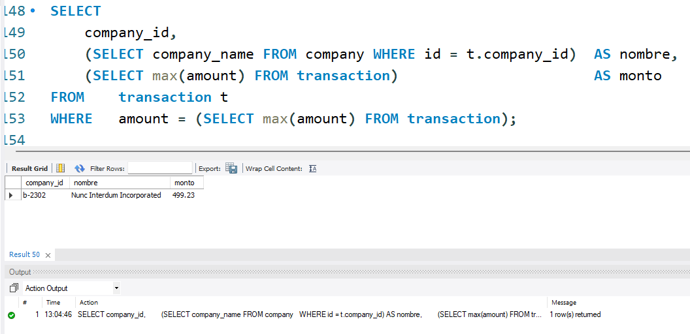

# Sprint 2: Nivel 1
### rectificaciones

## Exercici 1
Mostra totes les transaccions realitzades per empreses d'Alemanya.	

#### Respuesta 
Para resolver este exercici utilizo el siguiente código: 
- Para realizarlo at traves de subquery:

## Exercici 2
Màrqueting està preparant alguns informes de tancaments de gestió, et demanen que els passis un llistat de les empreses que han realitzat transaccions per una suma superior a la mitjana de totes les transaccions.

#### Respuesta 

**Paso 1**: Genero la subquery para obtener la lista de id de las empresas cuyo valor de la media tranacciones fue mayor a la media.

**Paso 2**: Utilizo subquery con el comando ***WHERE*** y con la funcion IN para ligarla a la subquery.

## Exercici 3

El departament de comptabilitat va perdre la informació de les transaccions realitzades per una empresa, però no recorden el seu nom, només recorden que el seu nom iniciava amb la lletra c. Com els pots ajudar? Comenta-ho acompanyant-ho de la informació de les transaccions.

#### Respuesta

1. Primero genero la subquery para identificar aquellas compañias que cumplen con la condicion de comenzar con la letra "c". El comando _**LIKE**_ permite buscar un patrón, que en este caso es que la primera letra comience por "c".

El resultado completo es el siguiente: 

## Exercici 4 - revisar not in , in

Van eliminar del sistema les empreses que no tenen transaccions registrades, lliura el llistat d'aquestes empreses.

#### Respuesta

- El _IN_ sirve para specify multiple possible values for a column, 
- Puedo generar una subquery con los valores de una tabla

En otras palabras, esta parte de la consulta selecciona solo aquellas filas de la tabla ***transaction*** cuyo _company_id_ no está presente en la columna _id_ de la tabla ***company***.

En este caso todas las compañias tienen transacciones, por lo que el output queda igual a ***company***.

# Sprint 2- Nivel 2
## Exercici 1
En la teva empresa, es planteja un nou projecte per a llançar algunes campanyes publicitàries per a fer competència a la companyia **Non Institute**. Per a això, et demanen la llista de totes les transaccions realitzades per empreses que estan situades en el mateix país que aquesta companyia.

### Comentario: Nos habian dicho en clase que la empresa era la otra.

### Respuesta Corregida con subquery:

- Creo una subquery que tenga como resultado el pais de la empresa
- Despues creo otra query que genere la lista de las empresas que tienen el mismo pais
- Finalmente genero el Query con las subquery en el **WHERE**

## Exercici 2

### Respuesta 

1. El company_id me serivrá para obtener el nombre y el monto ya que los utilizaré en las otras subqueries del las **SELECT**
2. Una subquery me que entregue el company_name en base el company_id anterior
3. Otra subquery que me entreque el monto maximo  de las transacciones.
4. la siguiente subquery es la importante ya que me permitira tener el company_id necesario para las otras querys

# Sprint 2 - Nivell 3
## Exercici 1
S'estan establint els objectius de l'empresa per al següent trimestre, per la qual cosa necessiten una base sòlida per a avaluar el rendiment i mesurar l'èxit en els diferents mercats. Per a això, necessiten el llistat dels països la mitjana de transaccions dels quals sigui superior a la mitjana general.

### Respuesta Corregida con subquery:

## Exercici 2
El Departament de recursos humans vol un llistat de les empreses on especifiquis si tenen més de 4 transaccions o menys.

### Respuesta Corregida con subquery

- En este caso tengo una tabla en la que creo una columna llamada "result" en la que indico si tiene "Mes de 4 trasnacciones" o "menys de 4 trasnacciones"
- Para ello, utilizo un comando CASE que permite establecer una condicion.
- En este casodevuelve 101 resultado por que está incluido el b-9999.  
