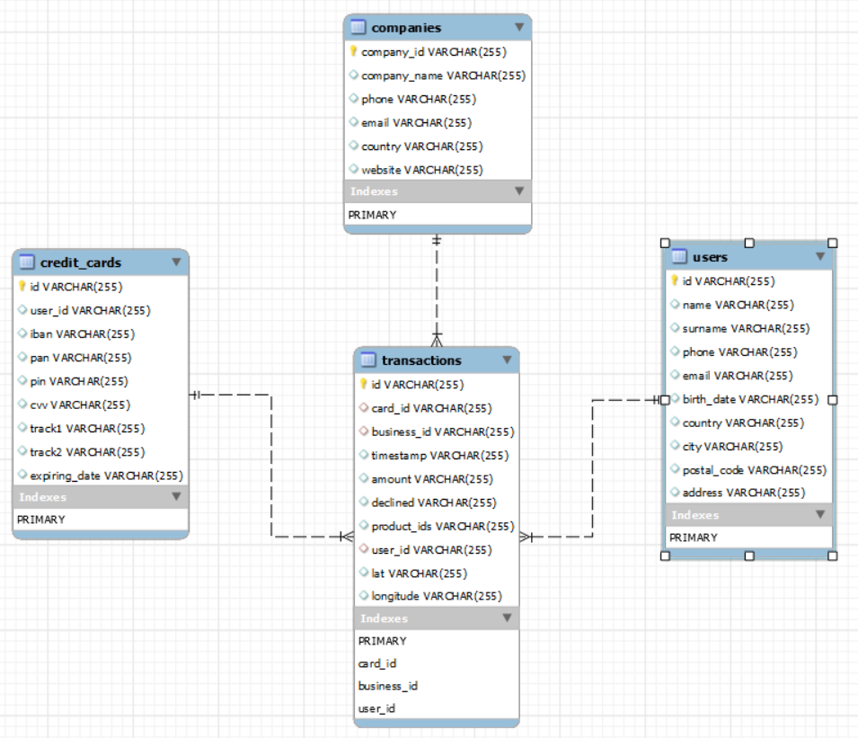
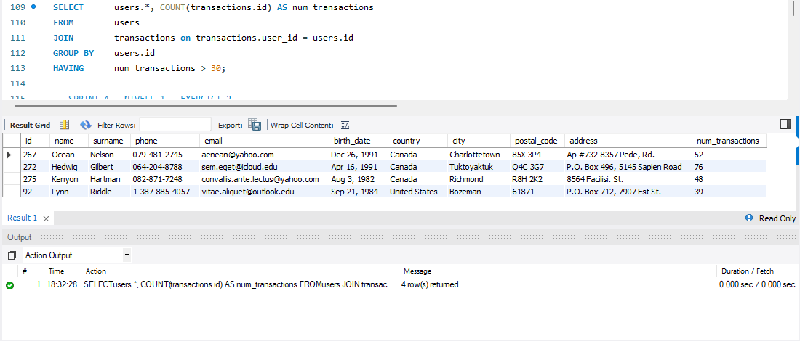
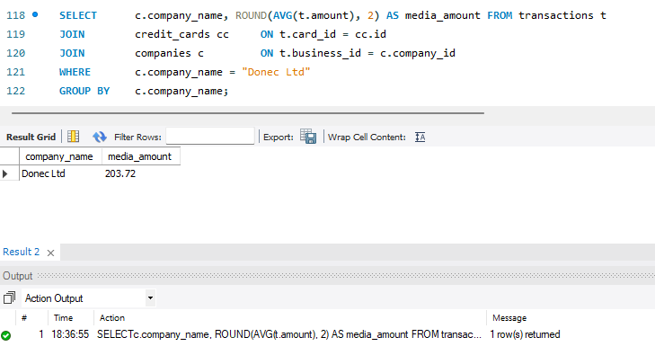
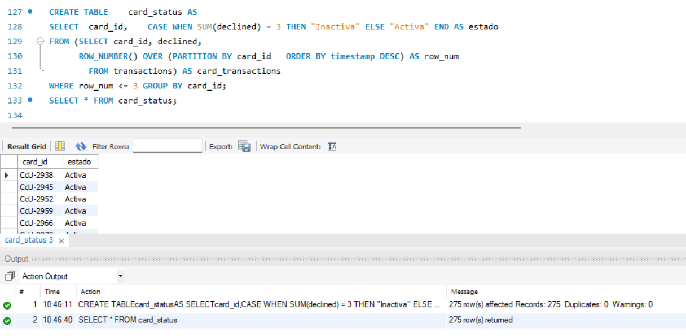
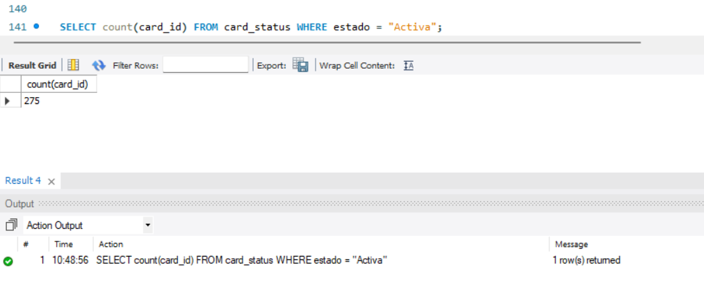
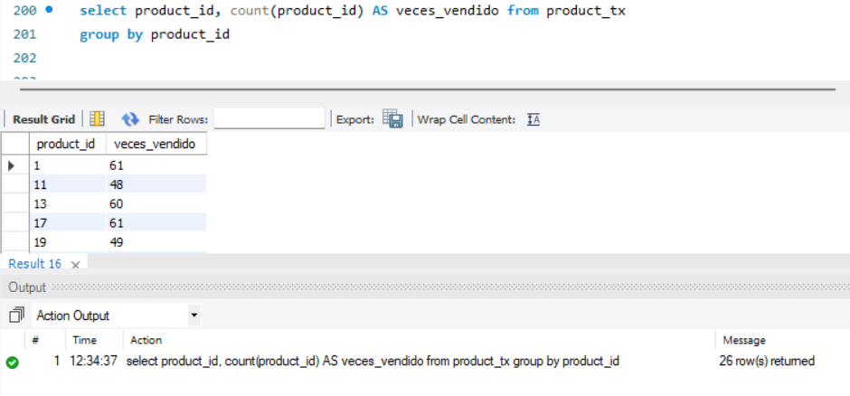

# Sprint 4

-- Descàrrega els arxius CSV, estudia'ls i dissenya una base de dades amb un esquema d'estrella que contingui, almenys 4 taules.

- Creo cada tabla y cargo la información contenida en los archivos csv
```sql
CREATE TABLE companies (
	company_id 		VARCHAR (255) PRIMARY KEY,
    company_name 	VARCHAR (255),
    phone 			VARCHAR (255),
    email			VARCHAR (255),
    country 		VARCHAR (255),
    website 		VARCHAR (255));

LOAD DATA INFILE 'C:/ProgramData/MySQL/MySQL Server 8.0/Uploads/companies.csv'
INTO TABLE companies
FIELDS TERMINATED BY ',' 
ENCLOSED BY '"'
LINES TERMINATED BY '\r\n'
IGNORE 1 ROWS
(company_id,company_name,phone,email,country,website);

CREATE TABLE credit_cards (
	id 		VARCHAR (255) PRIMARY KEY,
    user_id VARCHAR (255),
    iban 	VARCHAR (255),
    pan 	VARCHAR (255),
    pin 	VARCHAR (255),
    cvv 	VARCHAR (255),
    track1 	VARCHAR (255),
    track2 	VARCHAR (255),
    expiring_date VARCHAR (255));

LOAD DATA INFILE 'C:/ProgramData/MySQL/MySQL Server 8.0/Uploads/credit_cards.csv'
INTO TABLE credit_cards
FIELDS TERMINATED BY ',' 
ENCLOSED BY '"'
IGNORE 1 ROWS
(id,user_id,iban,pan,pin,cvv,track1,track2,expiring_date);

-- Creo la tabla users para unir las tablas user_uk, user_usa y user_ca
CREATE TABLE users (
	id 			VARCHAR (255) PRIMARY KEY,
    name 		VARCHAR (255),
    surname 	VARCHAR (255),
    phone 		VARCHAR (255),
    email 		VARCHAR (255),
    birth_date 	VARCHAR (255),
    country 	VARCHAR (255),
    city 		VARCHAR (255),
    postal_code VARCHAR (255),
    address 	VARCHAR (255));

LOAD DATA INFILE 'C:/ProgramData/MySQL/MySQL Server 8.0/Uploads/users_ca.csv'
INTO TABLE users
FIELDS TERMINATED BY ',' 
ENCLOSED BY '"'
LINES TERMINATED BY '\r\n'
IGNORE 1 ROWS
(id,name,surname,phone,email,birth_date,country,city,postal_code,address);

LOAD DATA INFILE 'C:/ProgramData/MySQL/MySQL Server 8.0/Uploads/users_uk.csv'
INTO TABLE users
FIELDS TERMINATED BY ',' 
ENCLOSED BY '"'
LINES TERMINATED BY '\r\n'
IGNORE 1 ROWS
(id,name,surname,phone,email,birth_date,country,city,postal_code,address);

LOAD DATA INFILE 'C:/ProgramData/MySQL/MySQL Server 8.0/Uploads/users_usa.csv'
INTO TABLE users
FIELDS TERMINATED BY ',' 
ENCLOSED BY '"'
LINES TERMINATED BY '\r\n'
IGNORE 1 ROWS
(id,name,surname,phone,email,birth_date,country,city,postal_code,address);

-- creo la tabla transaction con los foreing key, haciendo referencia a las relaciones con las otras tablas:

CREATE TABLE transactions (
    id 			VARCHAR(255) PRIMARY KEY,
    card_id 	VARCHAR(255),
    business_id VARCHAR(255),
    timestamp 	VARCHAR(255),
    amount 		VARCHAR(255),
    declined 	VARCHAR(255),
    product_ids VARCHAR(255),
    user_id 	VARCHAR(255),
    lat 		VARCHAR(255),
    longitude 	VARCHAR(255),
    FOREIGN KEY (card_id) REFERENCES credit_cards(id),
    FOREIGN KEY (business_id) REFERENCES companies(company_id),
    FOREIGN KEY (user_id) REFERENCES users(id)
);

LOAD DATA INFILE 'C:/ProgramData/MySQL/MySQL Server 8.0/Uploads/transactions.csv'
INTO TABLE transactions
FIELDS TERMINATED BY ';'   -- En este caso los campos estan separados por ";" y no por ","
ENCLOSED BY '"'
LINES TERMINATED BY '\r\n'
IGNORE 1 ROWS
(id,card_id,business_id,timestamp,amount,declined,product_ids,user_id,lat,longitude);
```

Este codigo permite tener el siguiente esquema:  



Este es un esquema de estrella que muestra la relacion 1:n de las tablas 'credit_cards', 'users' y 'companies' con la tabla 'transactions'.

## SPRINT 4 - NIVELL 1 - EXERCICI 1

Realitza una subconsulta que mostri tots els usuaris amb més de 30 transaccions utilitzant almenys 2 taules.


En este caso he utilizado las tablas 'users' y 'transaction' para obtener la respuesta.

## SPRINT 4 - NIVELL 1 - EXERCICI 2

Mostra la mitjana de la suma de transaccions per IBAN de les targetes de crèdit en la companyia Donec Ltd. utilitzant almenys 2 taules.



Para esta este caso utilice las tablas 'credit_cards', 'transactions' y 'companies'.

## SPRINT 4 - NIVELL 2 

Crea una nova taula que reflecteixi l'estat de les targetes de crèdit basat en si les últimes tres transaccions van ser declinades.




Para establecer la relacion con las otra tablas, defino las PK y FK respectivamente:

```sql
ALTER TABLE card_status
ADD PRIMARY KEY (card_id);

ALTER TABLE credit_cards
ADD CONSTRAINT fk_card_id
FOREIGN KEY (id) REFERENCES card_status(card_id);
```

## SPRINT 4 - NIVELL 2   Exercici 1

Quantes targetes estan actives?

Para ello establezco la consulta con la tabla generada anteriormente:




## SPRINT 4 - NIVELL 3

Crea una taula amb la qual puguem unir les dades del nou arxiu products.csv amb la base de dades creada, tenint en compte que des de transaction tens product_ids.

Lo primero es crear la tabla de products a partir de del archivo entregado:

```sql
CREATE TABLE products (
	id 				VARCHAR (255) PRIMARY KEY,
    product_name 	VARCHAR (255),
    price			VARCHAR (255),
    colour			VARCHAR (255),
    weight	 		VARCHAR (255),
	warehouse_id	VARCHAR (255));

LOAD DATA INFILE 'C:/ProgramData/MySQL/MySQL Server 8.0/Uploads/products.csv'
INTO TABLE products
FIELDS TERMINATED BY ',' 
ENCLOSED BY '"'
IGNORE 1 ROWS
(id,product_name,price,colour,weight,warehouse_id);
```

Para relacionar esta la tabla product con la tabla transaction , lo que defino es una tabla intermedia que contenga el transaction.id y product.id

Para ello creo la tabla product_tx

```sql
CREATE TABLE product_tx (
	transaction_id VARCHAR (255), 
    product_id VARCHAR (255));
    
INSERT INTO product_tx (transaction_id, product_id)
SELECT 	t.id AS transaction_id,
		CAST(SUBSTRING_INDEX(SUBSTRING_INDEX(t.product_ids, ',', p.id), ',', -1) AS UNSIGNED) AS product_id
FROM  	transactions t
JOIN  	products p ON 1
WHERE 	p.id <= LENGTH(t.product_ids) - LENGTH(REPLACE(t.product_ids, ',', '')) + 1;
```

Ahora relaciono la tabla products con transactios a traves de la tabla product_tx

```sql
ALTER TABLE product_tx
ADD CONSTRAINT fk_transaction_id
FOREIGN KEY (transaction_id) REFERENCES transactions(id);
ALTER TABLE product_tx
ADD CONSTRAINT fk_product_id
FOREIGN KEY (product_id) REFERENCES products(id);
```

El modelo final queda de la siguiente manera:


## SPRINT 4 - NIVELL 3 Exercici 1

Necessitem conèixer el nombre de vegades que s'ha venut cada producte.

Para ello realizo un select de la tabla generada anteriormente de 'product_tx'


