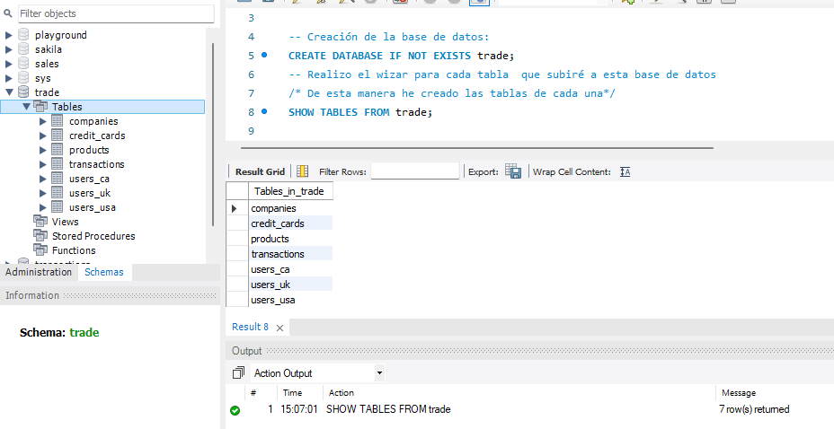
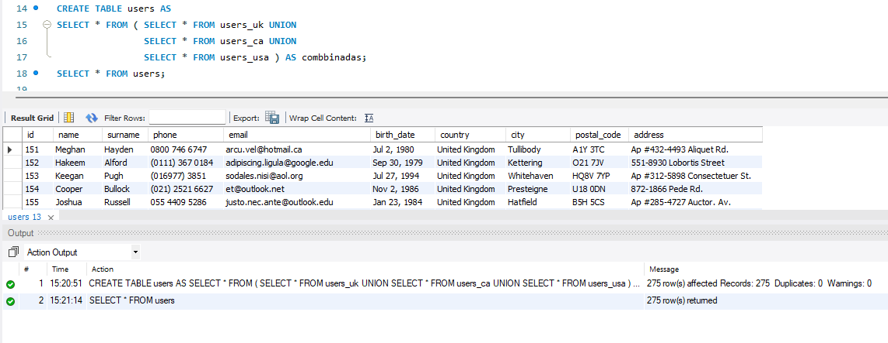
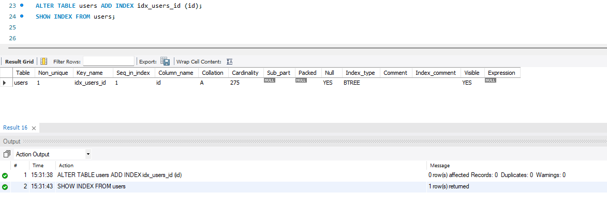
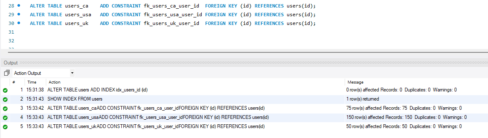
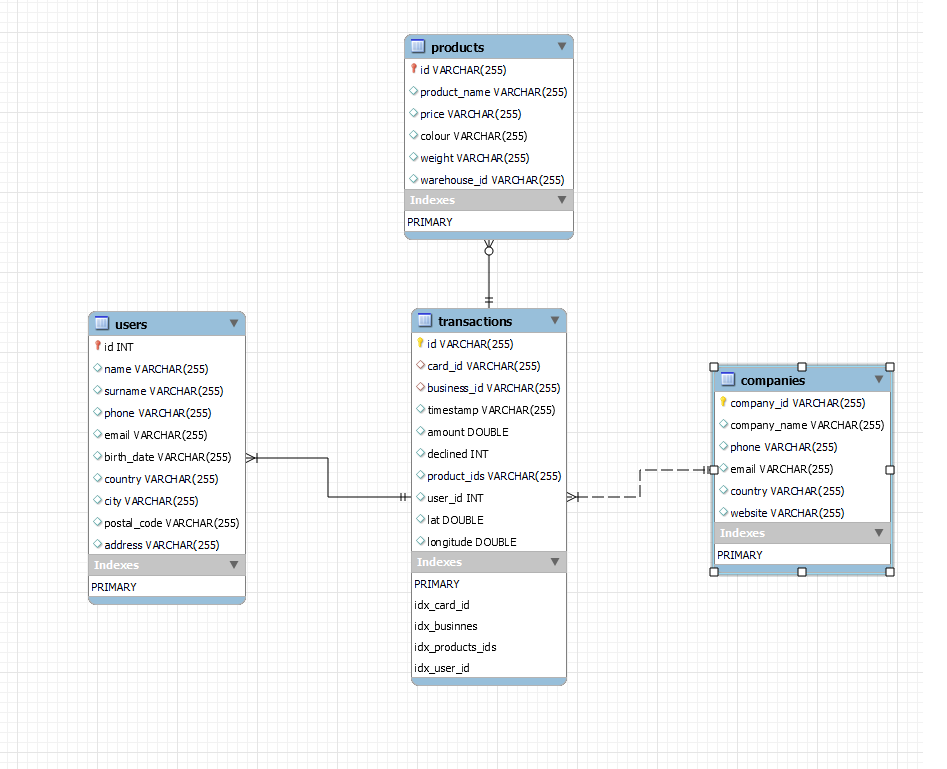
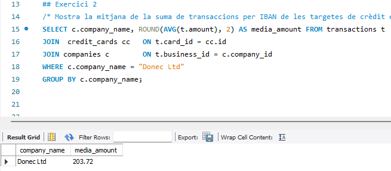
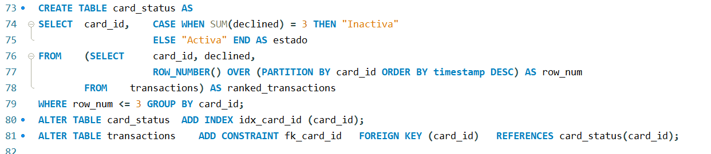
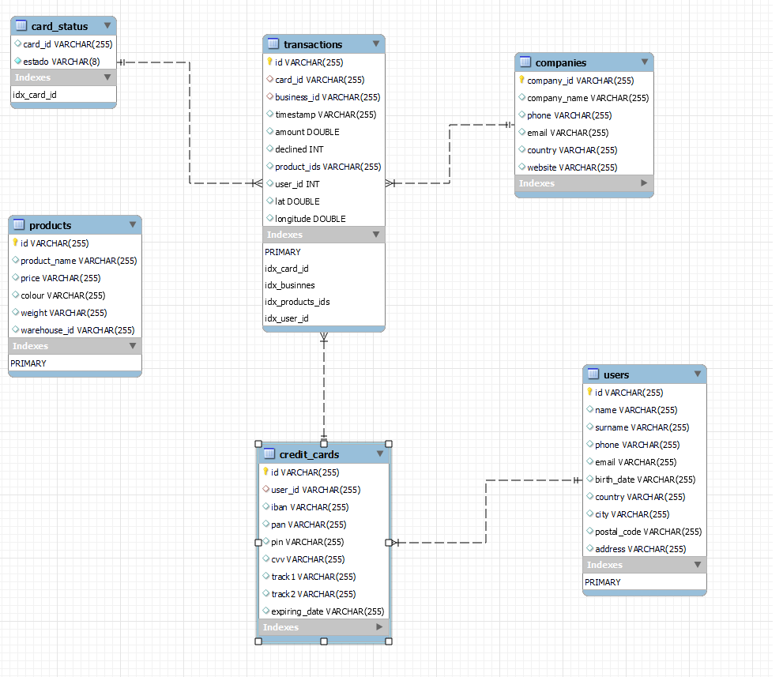
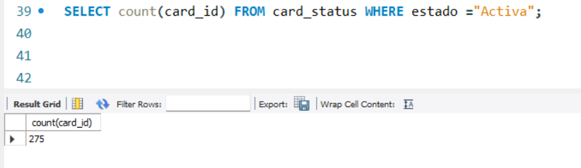
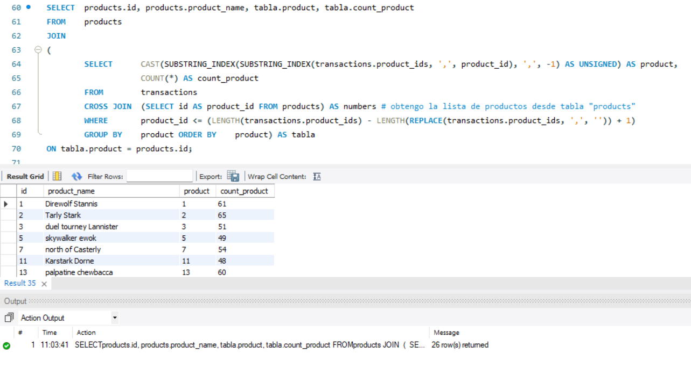

# Sprint 4 - Nivel 1

## Esquemas

Descàrrega els arxius CSV, estudia'ls i dissenya una base de dades amb un esquema d'estrella que contingui, almenys 4 taules.

**Realizo los siguientes pasos:**

1. Crear una base de datos llamada *trade* y en ella realizo la importación de los archivos *.csv* ***table import wizard***:


2. Al evaluar las tablas, es posible observar que *users_ca*, *users_uk* y *users_usa* tienen los mismo campos. Por esta razón, creo una nueva tabla llamada ***users***


### Definición de relaciones , PK, FK e INDEX

- Creo el index para la tabla users, que será id. De esta manera puedo crear las claves primarias:


- Ahora creo las claves foreing para cada tabla:


A continuacion muestro el resto de comandos utilizados:

```sql
-- Creación de la base de datos:

-- Claves primarias:
ALTER TABLE companies       ADD PRIMARY KEY (company_id);
ALTER TABLE credit_cards    ADD PRIMARY KEY (id);
ALTER TABLE products        ADD PRIMARY KEY (id);
ALTER TABLE transactions    ADD PRIMARY KEY (id);
ALTER TABLE users           ADD PRIMARY KEY (id);
ALTER TABLE users_ca        ADD PRIMARY KEY (id);
ALTER TABLE users_uk        ADD PRIMARY KEY (id);
ALTER TABLE users_usa       ADD PRIMARY KEY (id);

-- Genero los index:
ALTER TABLE transactions ADD INDEX idx_card_id (card_id);
ALTER TABLE transactions ADD INDEX idx_businnes (business_id);
ALTER TABLE transactions ADD INDEX idx_products_ids (product_ids);
ALTER TABLE transactions ADD INDEX idx_user_id (user_id);
ALTER TABLE credit_cards ADD INDEX idx_user_id (user_id);

-- Ahora creo las claves foráneas para cada tabla:
ALTER TABLE transactions ADD CONSTRAINT fk_c__id FOREIGN KEY (business_id) REFERENCES companies(company_id);
ALTER TABLE credit_cards ADD CONSTRAINT fk_cc_user_id FOREIGN KEY (user_id) REFERENCES users(id);
ALTER TABLE transactions ADD CONSTRAINT fk_t_card_id FOREIGN KEY (card_id) REFERENCES credit_cards(id);
ALTER TABLE transactions ADD CONSTRAINT fk_t_prdid FOREIGN KEY (product_ids) REFERENCES products(id);
```

El esquema de estrella seria así:




## Exercici 2

Mostra la mitjana de la suma de transaccions per IBAN de les targetes de crèdit en la companyia Donec Ltd. utilitzant almenys 2 taules.
Agrego corrección para que el monto sea bajo dos decimales:



# Sprint 4 - Nivel 2

Crea una nova taula que reflecteixi l'estat de les targetes de crèdit basat en si les últimes tres transaccions van ser declinades.

En este caso, utilizo un condicional para realizar esta tabla. El `CASE`permite realizar la condición y con ello identificar las tarjetas como ***activas*** o ***inactivas*** de acuerdo a si la suma de *declined* es es 3 (***inactiva***) o menor (***activa***)

Utilizo `ROW_NUMBER`para identificar en orden el *timestamp*, es decir, las fechas de las transacciones.  Ademas indico los comando de las relacion con transactions.



El equema de relacion con las otra tablas es:



## Exercici 1

Quantes targetes estan actives?



- De acuerdo a esta consulta, todas las tarjetas estan activas. Es decir, ninguna tiene tres rechazos en las ultimas transacciones.

# Sprint 4 - Nivel 3

Crea una taula amb la qual puguem unir les dades del nou arxiu ***products.csv*** amb la base de dades creada, tenint en compte que des de transaction tens ***product_ids***. Genera la següent consulta:

## Exercici 1

Necessitem conèixer el nombre de vegades que s'ha venut cada producte.



En la siguiente tabla explico algunos puntos del código utilizado:
| Componente         |Descripción                                                                             |
|--------------------|----------------------------------------------------------------------------------------|
| `SUBSTRING_INDEX()`| Divide la cadena de **product_id** basada en el índice.                                |
| `CAST()`           | La utilizo para para convertir el resultado en un entero sin igno.                     |
| `WHERE`            | Asegurar que solo se seleccionen productos que estén dentro de la lista de productos   |
| `CROSS JOIN`       | Genera identificadores de la tabla `products` y combinarla con la tabla `transactions` |
