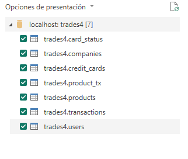
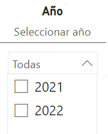
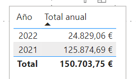
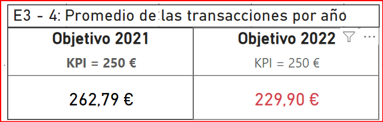
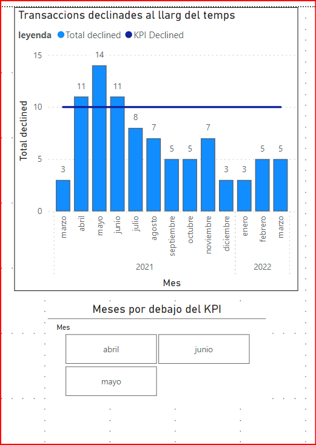
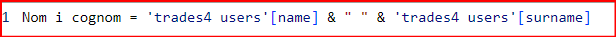
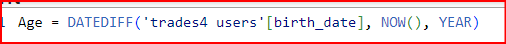
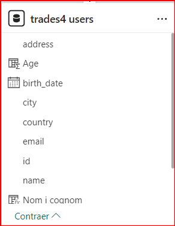
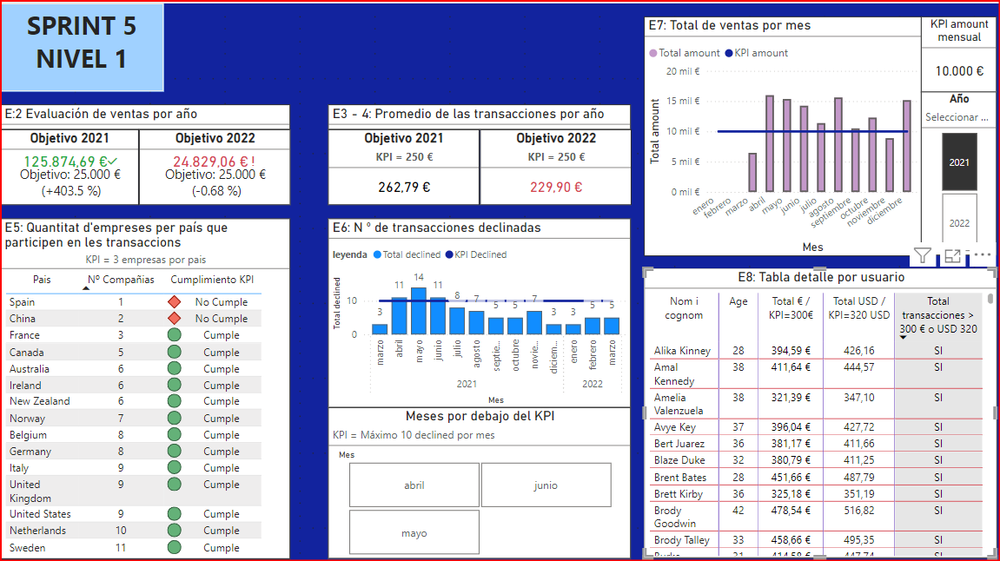

# Sprint 5

## Nivell 1 - Exercici 1

Importa les dades de la base de dades emprada prèviament. Després de carregar les dades, mostra el model de la base de dades en Power BI.

1. En primer lugar, importo la base de datos llamada 'trades4' del sprint anterior:        
   

2. Una vez importadas la tablas, realizo las transaformaciones para los campos que sean fechas, amount , price de las tablas. De esta manera podré utilizarlas posteriormente de manera óptima.
  
    |

1. Finalmente es modelo queda de la siguiente manera:
   


4. Para desarrollar los ejercicios crearé una tabla que me permita almacenar las medidas y calculos que vaya desarrollando a lo largo del ejercicio. Para ello debo:
   1. Insertar datos
   2. nombrarlo 'medidasLog'
   3. comenzar a crear en esta tabla las medidas que escriba.
   

## Nivell 1 - Exercici 2

La teva empresa està interessada a avaluar la suma total del amount de les transaccions realitzades al llarg dels anys. Per a aconseguir això, s'ha sol·licitat la creació d'un indicador clau de rendiment (KPI). El KPI ha de proporcionar una visualització clara de l'objectiu empresarial d'aconseguir una suma total de 25.000 € per cada any.

1. En este caso lo primero es crear una medida que indique el KPI de 25.000 € en la tabla 'medidaslog': ```KPI = 25000```
2. A través de la segmentación de datos, creo una etiqueta que permita seleccionar el año, ya sea 2021, 2022 o ambos:       
    
3. Realizo una tabla que tenga como campos 'timestamp - year' y 'suma total de amount'.  
    
4. Finalmente utilizo la visualizacion de KPI para indicar el objetivo en 2021 y 2022.
   1. KPI = 25.000 €
   2. timestamp 
   3. total amount (Suma)

### Análisis Visualización Ejercicio 2

El dashboard queda de la siguiente manera:


### Análisis de KPI

#### Año 2021
En **2021**, las transacciones anuales alcanzaron un total de **125.874,69 €**, superando con creces el objetivo establecido de **25.000 €**. Este rendimiento representa un **403,5%** por encima del objetivo, lo que indica un desempeño excepcional y una notable eficiencia en las operaciones.

#### Año 2022
Hasta marzo de **2022**, las transacciones anuales suman **24.829,06 €**, lo que es ligeramente inferior al objetivo de **25.000 €**, con una diferencia del **0,68%** por debajo de la meta. Es importante notar que estos datos sólo abarcan hasta marzo, lo que significa que aún hay tiempo suficiente para alcanzar y posiblemente superar el objetivo anual.

### Resumen Comparativo
- **Año 2021**: 
  - **Objetivo**: 25.000 €
  - **Realizado**: 125.875 €
  - **Desviación**: +403,5%
  - **Comentario**: El objetivo anual no solo se cumplió sino que se superó significativamente, demostrando una gestión y ejecución extraordinarias.
  
- **Año 2022**: 
  - **Objetivo**: 25.000 €
  - **Realizado (hasta marzo)**: 24.829 €
  - **Desviación**: -0,68%
  - **Comentario**: A pesar de estar ligeramente por debajo del objetivo, el desempeño hasta marzo es prometedor. Con los nueve meses restantes, hay un amplio margen para alcanzar y exceder el objetivo anual.

### Consideraciones Finales
- **Eficiencia Operativa**: El impresionante rendimiento del 2021 sugiere procesos eficientes y una fuerte capacidad de mercado.
- **Proyección 2022**: Con solo un 0,68% por debajo del objetivo a marzo, el 2022 muestra un buen progreso y potencial para cerrar el año con resultados positivos.

Estas observaciones indican una tendencia favorable en las transacciones anuales y resaltan la importancia de continuar monitoreando y ajustando estrategias para asegurar el cumplimiento de los objetivos establecidos.

---

Para cualquier consulta adicional o detalles específicos, por favor, refiérase a las secciones detalladas del dashboard.


## Nivell 1 - Exercici 3 -4 

Des de màrqueting et sol·liciten crear una nova mesura DAX que calculi la mitjana de suma de les transaccions realitzades durant l'any 2021. Visualitza aquesta mitjana en un mesurador que reflecteixi les vendes realitzades, recorda que l'empresa té un objectiu de 250.

Realitza el mateix procediment que vas realitzar en l'exercici 3 per a l'any 2022.

En este caso junto ambos exercicios y realizo pasos similares al ejercicio anterios:

1. Creo un KPI que indique el objetivo anual 'KPI = 250 €'

2. Creo las medidas DAX para obtener el valor para cada año:


3. Para cada caso aplico una configuración de formato para que el valor sea rojo cuando no cumple el KPI:


### Análisis y Recomendaciones para el Cumplimiento de Objetivos de Ventas en 2022

El dashboard queda de la siguiente manera:  



#### Interpretación de los Datos

- Las ventas promedio en 2021 superaron el objetivo en un 6.34%, alcanzando 265.85€. El objetivo para 2021 fue cumplido con una media de 262.79€, excediendo el objetivo en un 5.11%.

#### Análisis de por qué no se cumplió en 2022

- Posibles errores en la recolección de datos o cambios en el mercado podrían haber afectado las ventas en 2022. Factores internos como estrategias menos efectivas o problemas operativos podrían haber contribuido.

#### Estrategias para cambiar el rumbo en 2022

- Realizar un análisis detallado de datos para identificar áreas problemáticas y corregirlas. Ajustar estrategias de ventas y marketing según las tendencias del mercado y el análisis de datos.

#### ¿Se llegará al objetivo?

- Dependerá de la capacidad de la empresa para adaptarse y corregir los problemas identificados, así como de la eficacia de las estrategias implementadas. La clave para alcanzar los objetivos de ventas radica en la capacidad de la empresa para tomar decisiones informadas basadas en datos y en una comunicación efectiva tanto interna como externamente.

## Nivell 1 - Exercici 5

L'objectiu d'aquest exercici és crear una KPI que visualitzi la quantitat d'empreses per país que participen en les transaccions. La meta empresarial és garantir que hi hagi almenys 3 empreses participants per país. Per a aconseguir això, serà necessari utilitzar DAX per a calcular i representar aquesta informació de manera clara i concisa.

1. En primer lugar, creo el KPI = 3, para indicar el numero de empresas objetivo por pais
2. Creo una tabla que tenga los siguientes campos
   1. Country (companies)
   2. recuento de businnes_id, de la tabla transactions. De esta manera tengo aquellas copañias que tienen transacciones.
3. Creo una nueva columna en la tabla anterior que indique si cumple o no cumple. Esto lo realizo a través de una nueva medida DAX:

4. Agrego esta columna a la tabla anterior:         


5. Para que sea mas claro configuro un icono en la tabla en la columna 'cumplimiento KPI', de manera que en los casos de 'cumple' indique un simbolo verde y en caso de no cumple indique un simbolo rojo:        


### Analisis del exercici 5
Finalmente el dasboard queda así:       
    

#### Cumplimiento de Objetivos por País
Los datos muestran que España y China no cumplen con el objetivo establecido, ya que solo tienen 1 y 2 empresas participantes respectivamente. Por otro lado, el país que mejor cumple con el objetivo es Suecia, con un total de 11 compañías participantes.

#### Relación entre Número de Empresas y Transacciones
Es posible establecer una relación entre el bajo número de empresas en España y el bajo volumen de transacciones y ventas en general en ese país. La falta de participación empresarial puede estar contribuyendo a la disminución de las transacciones y ventas.

#### Estrategias de Mejora
Mejorar esta situación implicaría implementar estrategias más sólidas en los países con bajo número de empresas participantes, con el objetivo de aumentar las transacciones para el siguiente período. Sería necesario incrementar el esfuerzo y la atención en estos países, sin descuidar el control en aquellos que ya cumplen con el objetivo. Esto podría incluir acciones como campañas de marketing dirigidas, programas de incentivos para empresas, y una mayor atención al servicio al cliente en estos mercados específicos.


## Nivell 1 - Exercici 6
Crea una nova KPI que permeti visualitzar la quantitat de transaccions declinades al llarg del temps. L'empresa va establir un objectiu de tenir menys de 10 transaccions declinades per mes.

1. Lo primero es crear el KPI = 10 para darle visualizacion posterior
2. La visualización que elijo es un grafico de barras con lineas. De esta manera selecciono:
   1. timestamp: seleccionando 'mes' eje x.
   2. suma delined: para el eje y
   3. kPI declined para el eje y secundario
La tabla es la siguiente:       

    

3. Para reforzar la visualizacion agrego abajo la segmentacion de datos de manera que, mediante filtros, solo muestre aquellos meses en lo que no se alcanza el KPI (es decir que suma declined sea mayor o igual a 10). 

    


### Análisis de Cumplimiento del Objetivo

El dasboard final es el siguiente:      

   

Se observa que durante los meses de abril, mayo y junio, tanto en 2021 como en 2022, se superó el objetivo de tener menos de 10 transacciones declinadas. Sin embargo, al aplicar filtros por año, se encuentran las siguientes observaciones:

- **Año 2021**: Los meses de abril, mayo y junio están por encima del objetivo, con más de 10 transacciones declinadas.
- **Año 2022**: No hay ningún mes por encima del objetivo; todos los meses cumplen con tener menos de 10 transacciones declinadas.


## Nivell 1 - Exercici 7

Crea un gràfic de columnes agrupades que reflecteixi la sumatòria de les vendes per mes. L'objectiu de l'empresa és tenir almenys 10.000 transaccions per mes.

1. Creo el KPI = 10000 € en la tabla medidalog
2. Utilizo la segmentación de datos para crear un mosaico con los años 2021 y 2022. De esta manera podré diferenciar en el grafico que realizaré cada año y visualizarlos. Es importante señalar que debo indicar la "selección unica" para que el gráfico solo indique un año a la vez:


3. Realizo un grafico de barras y lineas considerando:
   1. eje x: meses
   2. eje y: suma amount
   3. eje y secundario: KPI = 10.000€


### Analisis del exercici 7

El dashboard es el siguiente: 


El resultado del gráfico considerando el total del tiempo de ventas (2021 y 2022) muestra que en enero, marzo, julio, septiembre y noviembre no se ha alcanzado el objetivo.

#### Resultados por Año:

- **Año 2021**: De los meses operativos, no se ha alcanzado el objetivo durante marzo, julio, septiembre y noviembre.

- **Año 2022**: De los meses operativos, no se ha alcanzado el objetivo ni en enero ni en marzo.


## Nivell 1 - Exercici 8
En aquest exercici, es vol aprofundir en les transaccions realitzades per cada usuari/ària i presentar la informació de manera clara i comprensible. En una taula, presenta la següent informació:

- Nom i cognom dels usuaris/es.
- Edat dels usuaris/es.
- Mitjana de les transaccions en euros.
- Mitjana de les transaccions en dòlars (conversió: 1 euro equival a 1,08 dòlars).
- S'han de fer els canvis necessaris per a identificar als usuaris/es que van tenir una mitjana de 300 o més euros i 320 o més dòlars en les seves transaccions.

1. Lo primero es crear una columna en la tabla 'users' que permita tener nombre y apellido. Esto lo hago mediante la siguiente comando DAX:
   

2. Lo siguiente es agregar una coluna con la edad de los usuarios, para ello utilizo el birth_date y utilizo la siguiente formula DAX:      
   

3. Visualizo las columnas creadas en la tabla 'users':      
   

4. Creo una nueva medida DAX para el cambio de € a USD:
   

5. Ahora creo la visualización de manera de tener una tabla que contenga los siguientes campos:

   1. Nom i cognom
   2. Age
   3. Promedio amount_ euros
   4. Amount_USD
   
   

6. Anteriormente habia agregado un icono para identificar a lado del valor si era mayor a no a lo solicitado. Ahora lo he cambiado por una columna adicional creada con DAX que indique si se sumple la condición solicitada de un total de 300 € "Y" 320 USD para cada ususario:

   

### Resultado exercici 8

  

## Nivell 1 - Exercici 9

Redacta un paràgraf breu, de màxim 50 paraules, explicant el significat de les xifres presentades en les visualitzacions de Power BI. 

Pots interpretar les dades en general o centrar-te en algun país específic. Acompanya les interpretacions realitzades amb la captura de pantalla de les visualitzacions que analitzaràs.

EL dashboard total queda de la siguiente manera:

   

### Análisis de KPIs de Ventas

Se han superado los objetivos de transacciones en 2021 y hay un buen progreso en 2022, con media de ventas anual superior al objetivo en 2021. Es necaesario aumentar participación empresarial en España y China, reducir transacciones declinadas y ajustar estrategias de ventas y marketing según tendencias estacionales. Finalmente se deben implementar estrategias de marketing específicas, optimizar operaciones y monitorear KPIs para adaptar estrategias y asegurar el cumplimiento de objetivos.