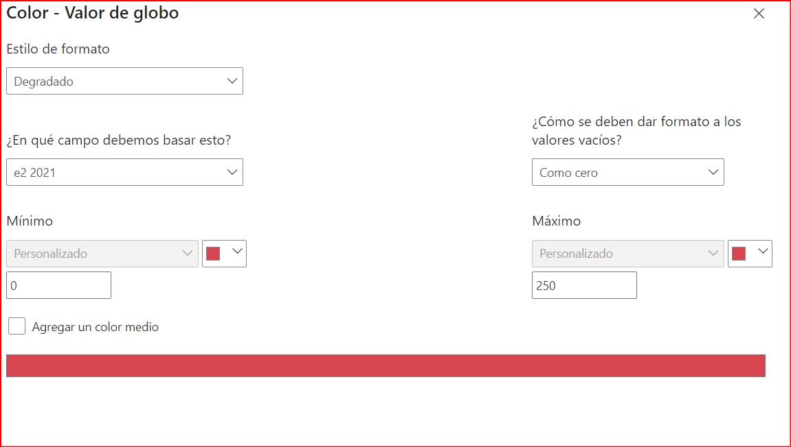
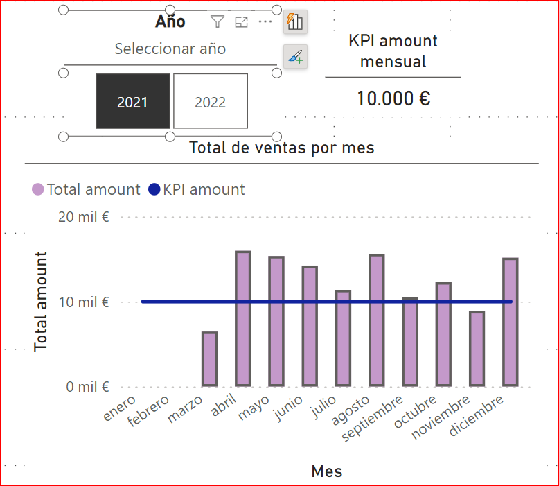
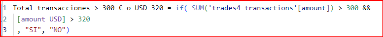

# Sprint 5

## Nivell 1 - Exercici 1

Importa les dades de la base de dades emprada prèviament. Després de carregar les dades, mostra el model de la base de dades en Power BI.

1. En primer lugar, importo la base de datos llamada 'trades4' del sprint anterior:        


2. Una vez importadas la tablas, realizo las transaformaciones para los campos que sean fechas, amount , price de las tablas. De esta manera podré utilizarlas posteriormente de manera óptima. :
|  Tabla     |  Campo       |     Transformación                   |
|------------|--------------|--------------------------------------|
|companies   |country       |{"country", type text},               |
|companies   |url           |{"website", type text}                |
|companies   |email         |{"email", type text}                  |
|Product     |price         | "$","",Replacer.ReplaceText,{"price"}|
|Product     |price         | {"price", Currency.Type}             |
|credit card | expired date | {"expiring_date", type date}         |
|transaction |timestamp     | {"timestamp", type datetime}         |
|transaction |amount        | {"amount", type number}              |
|users       |birth_date    | {"birth_date", type date}}           |

3. Finalmente es modelo queda de la siguiente manera:


4. Para desarrollar los ejercicios crearé una tabla que me permita almacenar las medidas y calculos que vaya desarrollando a lo largo del ejercicio. Para ello debo:
   1. Insertar datos
   2. nombrarlo 'medidasLog'
   3. comenzar a crear en esta tabla las medidas que escriba.

## Nivell 1 - Exercici 2

La teva empresa està interessada a avaluar la suma total del amount de les transaccions realitzades al llarg dels anys. Per a aconseguir això, s'ha sol·licitat la creació d'un indicador clau de rendiment (KPI). El KPI ha de proporcionar una visualització clara de l'objectiu empresarial d'aconseguir una suma total de 25.000 € per cada any.

1. En este caso lo primero es crear una medida que indique el KPI de 25.000 € en la tabla 'medidaslog': ```KPI = 25000```
2. A través de la segmentación de datos, creo una etiqueta que permita seleccionar el año, ya sea 2021, 2022 o ambos:       

3. Realizo una tabla que tenga como campos 'timestamp - year' y 'suma total de amount'. 

4. Finalmente utilizo la visualizacion de KPI para indicar el objetivo en 2021 y 2022.
   1. KPI = 25.000 €
   2. timestamp --> utilizo el filtro para indicar el año.
   3. total amount (Suma)

El dashboard queda de la siguiente manera:


## Nivell 1 - Exercici 3 -4 

Des de màrqueting et sol·liciten crear una nova mesura DAX que calculi la mitjana de suma de les transaccions realitzades durant l'any 2021. Visualitza aquesta mitjana en un mesurador que reflecteixi les vendes realitzades, recorda que l'empresa té un objectiu de 250.

Realitza el mateix procediment que vas realitzar en l'exercici 3 per a l'any 2022.

En este caso junto ambos exercicios y realizo pasos similares al ejercicio anterios:

1. Creo un KPI que indique el objetivo anual 'KPI = 250 €'

2. Creo las medidas DAX para obtener el valor para cada año:


3. Para cada caso aplico una configuración de formato para que el valor sea rojo cuando no cumple el KPI:


El dashboard queda de la siguiente manera:  


## Nivell 1 - Exercici 5

L'objectiu d'aquest exercici és crear una KPI que visualitzi la quantitat d'empreses per país que participen en les transaccions. La meta empresarial és garantir que hi hagi almenys 3 empreses participants per país. Per a aconseguir això, serà necessari utilitzar DAX per a calcular i representar aquesta informació de manera clara i concisa.

1. En primer lugar, creo el KPI = 3, para indicar el numero de empresas objetivo por pais
2. Creo una tabla que tenga los siguientes campos
   1. Country (companies)
   2. recuento de businnes_id, de la tabla transactions. De esta manera tengo aquellas copañias que tienen transacciones.
3. Creo una nueva columna en la tabla anterior que indique si cumple o no cumple. Esto lo realizo a través de una nueva medida DAX:

4. Agrego esta columna a la tabla anterior:         


5. Para que sea mas claro configuro un icono en la tabla en la columna 'cumplimiento KPI', de manera que en los casos de 'cumple' indique un simbolo verde y en caso de no cumple indique un simbolo rojo:        


Finalmente el dasboard queda así:       


## Nivell 1 - Exercici 6
Crea una nova KPI que permeti visualitzar la quantitat de transaccions declinades al llarg del temps. L'empresa va establir un objectiu de tenir menys de 10 transaccions declinades per mes.

1. Lo primero es crear el KPI = 10 para darle visualizacion posterior
2. La visualización que elijo es un grafico de barras con lineas. De esta manera selecciono:
   1. timestamp: seleccionando 'mes' eje x.
   2. suma delined: para el eje y
   3. kPI declined para el eje y secundario
La tabla es la siguiente:       


3. Para reforzar la visualizacion agrego abajo la segmentacion de datos de manera que, mediante filtros, solo muestre aquellos meses en lo que no se alcanza el KPI (es decir que suma declined sea mayor o igual a 10). 


El dasboard final es el siguiente:      


## Nivell 1 - Exercici 7

Crea un gràfic de columnes agrupades que reflecteixi la sumatòria de les vendes per mes. L'objectiu de l'empresa és tenir almenys 10.000 transaccions per mes.

1. Creo el KPI = 10000 € en la tabla medidalog
2. Utilizo la segmentación de datos para crear un mosaico con los años 2021 y 2022. De esta manera podré diferenciar en el grafico que realizaré cada año y visualizarlos


3. Realizo un grafico de barras y lineas considerando:
   1. eje x: meses
   2. eje y: suma amount
   3. eje y secundario: KPI = 10.000€


El dashboard es el siguiente: 


## Nivell 1 - Exercici 8
En aquest exercici, es vol aprofundir en les transaccions realitzades per cada usuari/ària i presentar la informació de manera clara i comprensible. En una taula, presenta la següent informació:

- Nom i cognom dels usuaris/es.
- Edat dels usuaris/es.
- Mitjana de les transaccions en euros.
- Mitjana de les transaccions en dòlars (conversió: 1 euro equival a 1,08 dòlars).
- S'han de fer els canvis necessaris per a identificar als usuaris/es que van tenir una mitjana de 300 o més euros i 320 o més dòlars en les seves transaccions.

1. Lo primero es crear una columna en la tabla 'users' que permita tener nombre y apellido. Esto lo hago mediante la siguiente comando DAX:


2. Lo siguiente es agregar una coluna con la edad de los usuarios, para ello utilizo el birth_date y utilizo la siguiente formula DAX:      


3. Visualizo las columnas creadas en la tabla 'users':      


4. Creo una nueva medida DAX para el cambio de € a USD:


5. Ahora creo la visualización de manera de tener una tabla que contenga los siguientes campos:

   1. Nom i cognom
   2. Age
   3. Promedio amount_ euros
   4. Amount_USD


6. Para identificar aquellos que tienen una mediana de 300 € o 320 USD o mas creo asigno un icono que indique al lado de cada cifa si cumple. Aqui muestro el ejemplo de configuración de icono en el caso de promedio amount en €:



## Nivell 1 - Exercici 9
Redacta un paràgraf breu, de màxim 50 paraules, explicant el significat de les xifres presentades en les visualitzacions de Power BI. Pots interpretar les dades en general o centrar-te en algun país específic. Acompanya les interpretacions realitzades amb la captura de pantalla de les visualitzacions que analitzaràs.


EL dashboar total queda de la siguiente manera:


### Análisis de KPIs de Ventas

Los KPIs proporcionan una visión del rendimiento durante el 2021, mientras que del 2022 se dispone de poca información. 

El año 2021, las ventas superaron ampliamente el objetivo anual, se superó la meta anual de transacciones. China y España tienen menos de 3 empresas, esto permite una oportunidad de mejora en estos mercados.

## Nivell 2 - Exercici 1

Des de l'àrea de màrqueting necessiten examinar la tendència mensual de les transaccions realitzades l'any 2021, específicament, volen conèixer la variació de les transaccions en funció del mes. Recorda visualitzar la meta empresarial d'aconseguir almenys 12.500 transaccions per mes. En aquest exercici, serà necessari que s'aconsegueixi identificar els mesos en què no es va aconseguir la meta establerta. De ser necessari pots realitzar dues visualitzacions.

1. Lo primero es crear la medida de KPI a través de la siguiente formula KPI mensual euros = 12500 €.
2. Creo una medida DAX que permita calcular la suma total de amount para el año 2021 y que pueda relacionarla con timestamp[mes]


3. Para la visualización descargo un objeto visual:   


4. Utilizo las medidas DAX y KPI para hacer mostrar la grafica:
   1. En el eje Y: timestamp[mes]
   2. En el eje X1: Total amount
   3. En el eje X2: KPI = 12500    


Se observa claramente que los meses que estaa por debajo del KPI


## Nivell 2 - Exercici 2

En el teu treball, es vol aprofundir en la comprensió de les transaccions realitzades a Alemanya. Per tant, et sol·liciten que desenvolupis mesures DAX per a crear visualitzacions que destaquin la mitjana de vendes a Alemanya. Tingues present que l'empresa té com a objectiu aconseguir una xifra de 250 euros anuals. Configura la visualització de manera que el valor mínim sigui 100 i el màxim 350, brindant així una representació més efectiva de la informació.

1. Creo una medida que sea 'KPI = 250'
2. La medida DAX será un promedio de las ventas, filtrando por alemania y para el año 2021:
   
3. finalemente realizo la configuración para la visualización:
     


La visualización del srpint 5, ejjercicio 2 queda de la siguiente manera:
    

## Nivell 2 - Exercici 3

Escriu un breu paràgraf, màxim de 25 paraules, indica en quin mes no es va arribar a complir amb l'objectiu proposat de l'exercici 1.

**Respuesta:**

Hubo 5 meses que no alcanzaron la meta. Será necesario analizar las causas (temporada baja, falta de campañas, etc.) para proponer estrategias de mejora y aumentar las ventas.

## Nivell 3 - Exercici 1
La secció de màrqueting vol aprofundir en les transaccions realitzades pels usuaris i usuàries. En conseqüència, se't sol·licita l'elaboració de diverses visualitzacions que incloguin:

Les mesures estadístiques claus de les variables que consideris rellevants per a comprendre les transaccions realitzades pels usuaris/es.
- Quantitat de productes comprats per cada usuari/ària.
- Mitjana de compres realitzades per usuari/ària, visualitza quins usuaris/es tenen una mitjana de compres superior a 150 i quins no.
- Mostra el preu del producte més car comprat per cada usuari/ària.
- Visualitza la distribució geogràfica dels usuaris/es.
En aquesta activitat, serà necessari que realitzis els ajustos necessaris en cada gràfic per a millorar la llegibilitat i comprensió. En el compliment d'aquesta tasca, s'espera que avaluïs acuradament quines variables són rellevants per a transmetre la informació requerida de manera efectiva.


