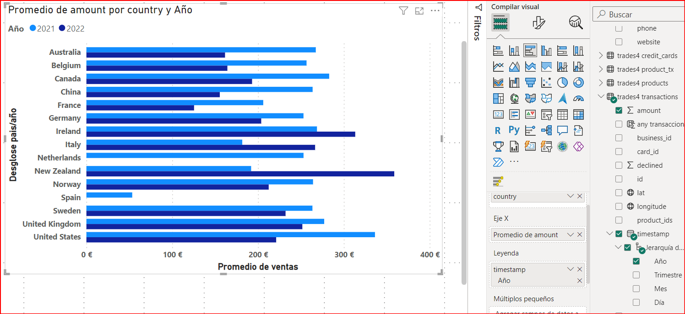
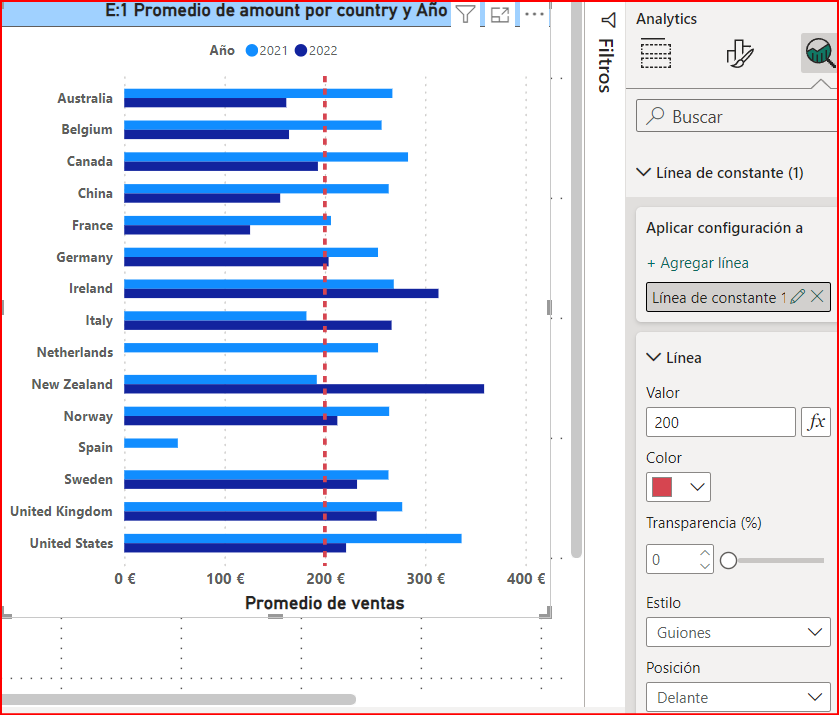
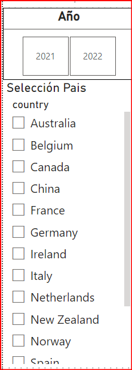
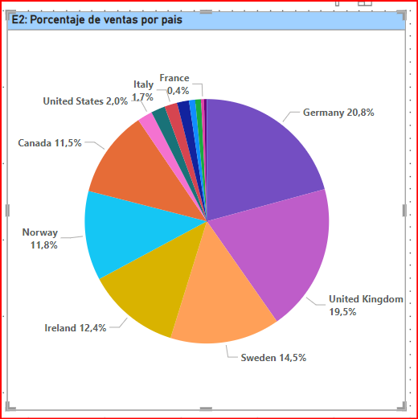
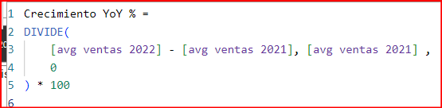

# SPRINT 6

## Nivell 1 - Exercici 1

#### Situación
La empresa necesita evaluar el rendimiento de las ventas a nivel internacional, detallando la media de ventas desglosadas por país y año, destacando aquellas inferiores a 200 euros anuales.

#### Desarrollo
Para ello, seguimos los siguientes pasos:

1. **Crear una tabla** con las columnas: país, año, y el promedio de ventas.
   

2. **Seleccionar un gráfico de barras agrupadas** para visualizar ventas por año y país.
   

3. **Agregar una línea constante** que indique el KPI de 200 €.
   

4. **Incluir una segmentación de datos** por año y país.
   

5. **Filtrar los datos** para asegurarse de que solo se muestran las transacciones aprobadas (`declined = 0`):
   

#### Descripción y Análisis

Finalmente, el dashboard resultante es el siguiente:

El dashboard resultante muestra:

1. **Desempeño de Ventas en el 2021:** en el año 2021, no se cumplen los objetivos de ventas en Italia, Nueva Zelanda y España. Sin embargo, en los 12 países restantes efectivamente se cumple el KPI de 200 €.
   
2. **Objetivos en el 2022:** Al momento de obtener estos datos es posible observar que pocos países alcanzan el objetivo de 200 €. Son siete países los que superan el KPI a la fecha del año 2022.
   
3. **Ausencia de Datos para los Países en el 2022:** Es posible observar que no hay datos disponibles para Países Bajos y España en el año 2022 en la visualización. Esto puede indicar que no hubo transacciones registradas para estos países en ese período.

#### Recomendaciones
1. **Estrategias de Marketing y Productos:** Revisar y ajustar estrategias en Italia, Nueva Zelanda y España debido al bajo rendimiento en 2021. Considerar factores como estrategias de marketing locales, productos ofrecidos y competencia.
2. **Análisis de Disminución en 2022:** Investigar las causas de la disminución general de ventas en 2022, considerando posibles problemas globales o de segmentación del mercado.
3. **Mejoras en Mercados con Bajas Transacciones:** Implementar mejoras en mercados con bajas transacciones, incluyendo revisiones logísticas y opciones de pago para facilitar las ventas.

## Nivell 1 - Exercici 2

#### Situación
La empresa está interesada en obtener una visión general de las transacciones realizadas por cada país. La tarea es crear una visualización que identifique el porcentaje de las ventas por país.

#### Desarrollo
Los pasos para lograr esto son:

1. **Crear una tabla** que indique país (country) y la suma del importe (amount).

2. **Filtrar los datos** para asegurarse de que solo se muestran las transacciones aprobadas (`declined = 0`):
   

3. **Configurar la visualización** para que muestre la categoría (country) y el porcentaje del total:
   

4. **Eliminar la interacción** entre los ejercicios 1 y 2, para no alterar la visualización.

#### Descripción y Análisis

El gráfico resultante es el siguiente:

El gráfico muestra la distribución de ventas por país, representada por diferentes colores. En este caso, se puede observar que:

1. **Alemania:** Tiene una participación superior al 20%, siendo el país con mayor participación en las ventas.
2. **Reino Unido, Suecia e Irlanda:** Siguen a Alemania en términos de participación en ventas.
3. **Norteamérica:** Incluyendo a Canadá y Estados Unidos, representa el 13.5% del total de las ventas.
4. **España:** Es el país con la menor participación en ventas, con solo el 0.07% del total.

#### Recomendaciones
1. **Asignación de Recursos:** Dirigir recursos adicionales a los países con alto potencial de crecimiento y buen desempeño, como Alemania y Reino Unido, para aprovechar su alta participación en ventas.
2. **Estrategias de Expansión:** Considerar estrategias específicas para mejorar la participación en ventas en países con baja contribución, como España, evaluando oportunidades para incrementar su mercado.

## Nivell 1 - Exercici 3

#### Situación
Diseñar un indicador visual en Power BI para analizar la diferencia de ventas entre los años 2022 y 2021 en cada país. La empresa está interesada en comprender cómo han variado las ventas en diferentes países durante este período y desea identificar cualquier disminución o aumento significativo en las ventas.

#### Desarrollo
Los pasos para lograr esto son:

1. **Crear dos medidas DAX** para obtener el promedio de ventas. Esto permite tener un valor que represente mejor las diferencias, ya que el 2021 contiene más datos que el 2022.
   
   

2. **Crear una medida DAX** para calcular el crecimiento comparando el año 2022 con 2021. De esta manera se obtiene un dato que permite saber si el crecimiento es positivo o negativo. Agrego el (0) que se devuelve si el denominador es 0 (para evitar errores de división por cero).

   La fórmula Crecimiento YoY % calcula el porcentaje de crecimiento de las ventas promedio de un año con respecto al año anterior, manejando de manera segura la posible división por cero y expresando el resultado como un porcentaje.
   

3. **Elegir la visualización** adecuada teniendo en cuenta lo siguiente:
   1. Será un gráfico que indique las ventas por año de cada país.
   2. Tendrá una línea o puntos que indiquen la variación de las ventas entre 2022 y 2021.

#### Descripción y Análisis

El gráfico resultante es el siguiente:

Se puede deducir que la mayoría de los países experimentaron una disminución en las ventas promedio al comparar los años 2022 y 2021. Esta disminución se destaca claramente en el gráfico, que resalta las diferencias negativas. No obstante, Nueva Zelanda, Irlanda e Italia registraron un aumento en sus ventas durante este período. Por otro lado, Países Bajos y España presentan una disminución del 100%, ya que no se registraron transacciones en estos países durante el 2022.

#### Recomendaciones
1. **Repetición de Campañas Exitosas:** Repetir campañas que demostraron un alto rendimiento y ajustar o descartar las menos efectivas.
2. **Comprobación en Campañas Reevaluadas:** Implementar comprobación en las campañas reevaluadas para optimizar los resultados antes de una implementación completa.

## Nivell 1 - Exercici 4

#### Situación
Crear una visualización en la cual se pueda contabilizar el número de transacciones rechazadas en cada país para medir la eficacia de las operaciones. La empresa espera tener menos de 5 transacciones rechazadas por país.

#### Desarrollo
Los pasos para lograr esto son:

1. **Utilizar una matriz** considerando país (country) y la suma de `declined`.
2. **Agregar un icono** que indique si el KPI de 5 transacciones rechazadas se alcanza por país:
   

#### Descripción y Análisis

El gráfico resultante es el siguiente:

Al visualizar los datos de 2022 y 2021, se observa que solo 6 de los 15 países cumplieron con el objetivo de tener un máximo de 5 transacciones declinadas. Estos países son Bélgica, Nueva Zelanda, Canadá, Francia, China y España. Cabe destacar que España tuvo solo 1 transacción declinada; sin embargo, esto se debe en parte a que el número total de transacciones en España es relativamente bajo.

#### Recomendaciones
1. **Revisar y Mejorar Procesos de Aprobación:** Revisar y mejorar los procesos de aprobación de transacciones para reducir el número de transacciones declinadas.
2. **Capacitación y Mejora Tecnológica:** Implementar capacitaciones y mejoras tecnológicas para optimizar las operaciones en mercados con bajo rendimiento.
3. **Evaluación de Productos y Servicios:** Evaluar productos y servicios del personal, considerando motivos logísticos y opciones de pago para productos de alto valor.

## Nivell 1 - Exercici 5

#### Situación
La empresa busca comprender la distribución geográfica de las ventas para identificar patrones y oportunidades específicas en cada región. Seleccionar la mejor visualización para mostrar esta información.

#### Desarrollo
Se genera una visualización mediante un mapa, donde el tamaño de las burbujas será relativo al recuento de transacciones de cada país. Así tenemos lo siguiente:

#### Descripción y Análisis

En el mapa de visualización, sobresale el Reino Unido y Alemania como los países con un mayor volumen de compras, mientras que Canadá, Suecia, Noruega e Irlanda presentan un número de transacciones intermedio. Por otro lado, los países con un menor número de transacciones incluyen a Estados Unidos, España, Francia, Italia, Bélgica, Países Bajos, China, Australia y Nueva Zelanda.

El tamaño de cada burbuja en el mapa se corresponde con el número de transacciones por país, lo que ofrece una representación visual precisa del nivel de actividad comercial.

#### Recomendaciones
1. **Identificación de Nuevos Mercados Prometedores:** Utilizar los datos de distribución geográfica de las ventas para identificar nuevos mercados prometedores. Países con un crecimiento en ventas, como Nueva Zelanda, Irlanda e Italia, pueden ser objetivos prioritarios para la expansión.
2. **Implementación de Campañas Piloto:** Implementar campañas piloto en nuevos mercados para evaluar su viabilidad antes de una expansión completa.
3. **Redirección de Recursos:** Considerar redirigir recursos de mercados con baja o nula actividad (como España y Países Bajos en 2022) hacia mercados emergentes o con mayor retorno.

## Nivell 1 - Exercici 6

#### Situación
El jefe ha pedido preparar una presentación para el equipo en la cual se detallen la información de todos los gráficos visualizados hasta ahora. Para cumplir con esta solicitud, es necesario proporcionar una interpretación de las visualizaciones obtenidas.

### Análisis de Transacciones en España

---

---

**España** se destaca por su baja participación en el panorama global de transacciones financieras. En el gráfico E2, esta realidad se hace evidente al observar la marcada diferencia en la participación de *España* en comparación con otros países.

Es notable mencionar que en el año 2022, *España* no registró ninguna transacción, lo que resultó en una media de ventas de **0 €** para dicho año. Esta circunstancia explica la drástica disminución del **100%** en el volumen de transacciones de *España* en ese período.

Adicionalmente, es importante destacar que solo se rechazó una transacción en *España*, una cifra notablemente por debajo del **KPI** establecido de **5** y también inferior al promedio de rechazos en otros países analizados. Aunque este dato sugiere un cumplimiento satisfactorio de los **KPIs**, también podría estar relacionado con el reducido volumen total de transacciones realizadas en el país.

Estos indicadores subrayan la necesidad de una mayor exploración y análisis del panorama financiero de *España* para comprender a fondo su posición en el contexto global.

### Conclusión

La clave para el renacimiento y éxito futuro de la empresa radica en una evaluación exhaustiva de los datos históricos, una asignación estratégica de recursos y una planificación cuidadosa de la expansión. Tomar decisiones basadas en datos precisos y actualizados, junto con una revisión crítica de las estrategias pasadas, permitirá a la empresa corregir sus fallos y aprovechar nuevas oportunidades de crecimiento. También es importante considerar la revisión del portafolio de productos y servicios ofrecidos en mercados con bajo rendimiento para asegurarse de que son relevantes y competitivos. Además, se deben ajustar las ofertas basadas en la demanda y preferencias locales para mejorar la aceptación del mercado.
