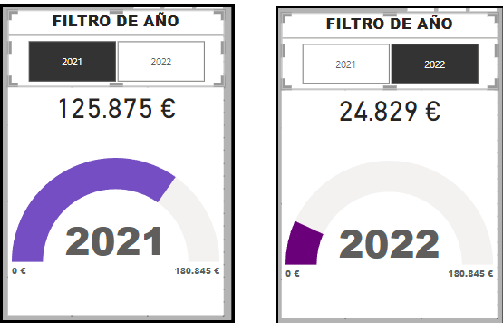

Previo a esto, es importante tener presente que crearé una nueva tabla denominada `customize`. En esta tabla agruparé todas aquellas medidas que solo utilizo para mejorar la gráfica.

# Ejercicio 1

### Situación

Tu tarea consiste en implementar un filtro interactivo que permita seleccionar las ventas para cada año.

### Desarrollo

Para realizar esto, necesitaré los siguientes elementos:
- Un objeto visual para ventas por año.
- Un objeto visual de filtro.

#### 1. Objeto visual de ventas por año

Selecciona un gráfico de barras agrupadas para mostrar la venta total por año. Para mejorar la visualización, mantén las unidades mínimas y máximas del eje Y. De esta manera, tendremos una claridad visual al momento de aplicar el filtro.

Para ajustar el valor máximo del eje Y y que sea al menos un 20% más alto que el valor máximo de la suma de las transacciones, debemos crear una medida en DAX que ignore los filtros de año. Esta medida debe estar en la tabla `customize`. El código DAX para esta medida es el siguiente:

- **Valor máximo del medidor**
    ```DAX
    MaxSumaVentasIncrementado = 
        CALCULATE(
            MAXX(
                ALL('trades4 transactions'),
                SUM('trades4 transactions'[amount])
            ) * 1.2,
            REMOVEFILTERS('trades4 transactions'[timestamp].[Año])
        )
    ```

- **Valor del globo del medidor**
    ```DAX
    SumYear = SUM('trades4 transactions'[amount])
    ```

#### 2. Objeto visual de filtro de año

Para el filtro de año, selecciona la opción de 'segmentación de datos' y utiliza el dato de `transaction[timestamp].[Año]`.

### Resultado

A continuación, se muestra el tipo de resultado esperado con cada filtro de año aplicado.




#### **Analisis**

#### **Recomendaciones**


# Ejercicio 2
La gerencia está interesada en analizar más a fondo las ventas en relación con el mes. Por lo tanto, te piden que hagas los ajustes necesarios para mostrar la información de esta manera.

# Ejercicio 3
Visualiza el total de ventas y la cantidad de transacciones realizadas. Si es necesario, puedes crear dos visualizaciones separadas.

# Ejercicio 4
Crea una visualización que permita observar de manera efectiva y clara la cantidad de ventas realizadas y la cantidad de transacciones rechazadas.

# Ejercicio 5
Selecciona una visualización en la que se reflejen los estadísticos descriptivos de las empresas que realizaron transacciones. Recuerda mostrar el total de cada estadístico.
