# SPRINT 6

## Nivell 1 -  Exercici 1

L'empresa necessita avaluar el rendiment de les vendes a nivell internacional. Com a part d'aquest procés, et demanen que triïs un gràfic en el qual es detalli la mitjana de vendes desglossades per país i any en una mateixa presentació visual. És necessari assenyalar les mitjanes que són menors a 200 euros anuals.

Para ello, seguimos los siguientes pasos:

1. **Crear una tabla** con las siguientes columnas: país, año, y el promedio de ventas para estos dos criterios.

   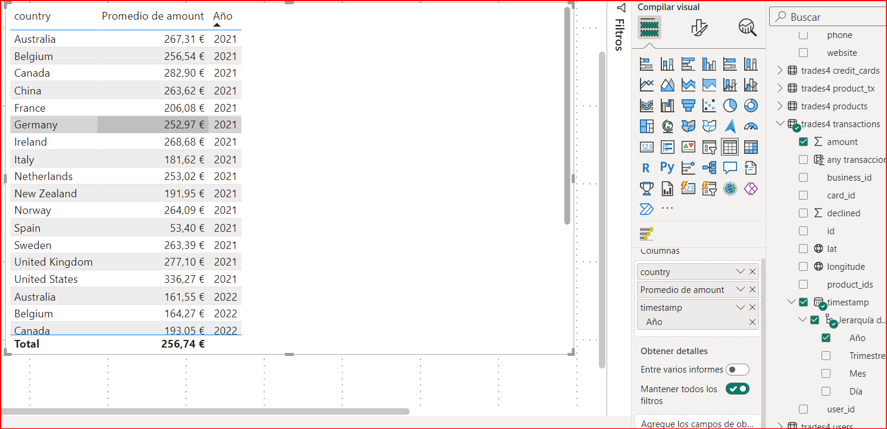

2. **Seleccionar un gráfico de barras agrupadas** que permita ver de manera ordenada las ventas por cada año en cada país.

    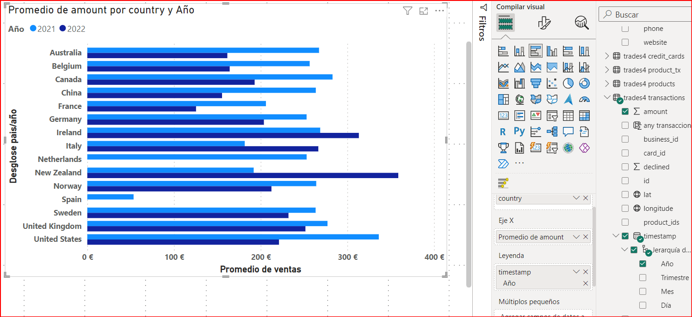

3. **Agregar una línea constante** que indique el KPI de 200 € para resaltar los promedios inferiores a este valor:

    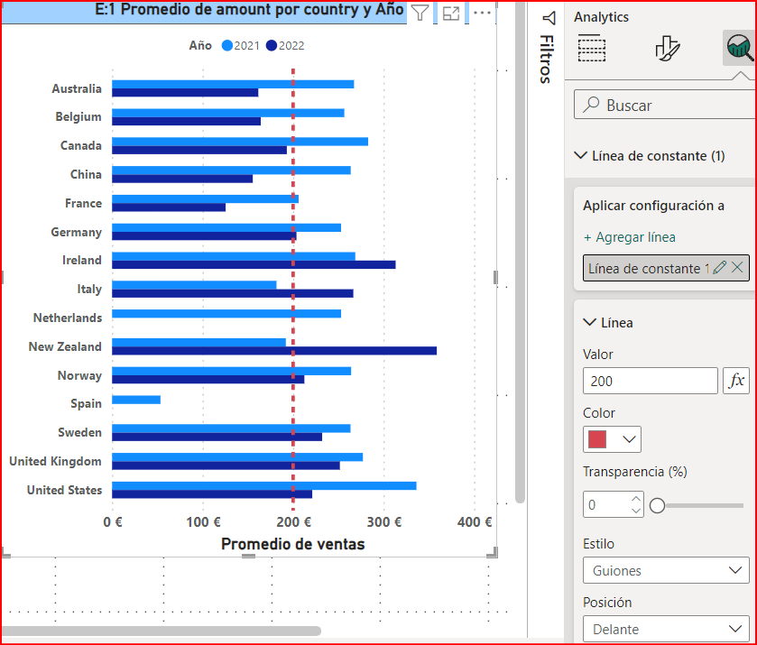

4. **Incluir una segmentación de datos** por año y país al lado del gráfico para un análisis dinámico de la visualización.

    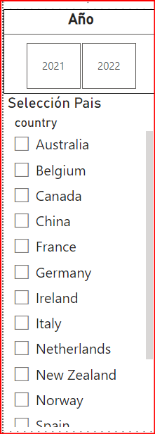

Finalmente, el dashboard resultante es el siguiente:

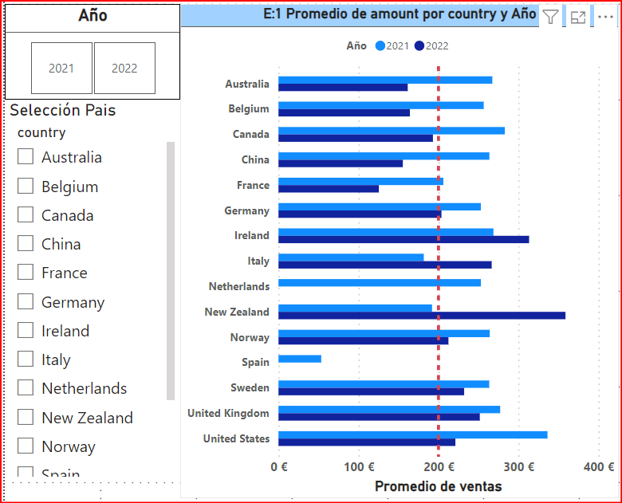

De esta visualización podemos ver que:

1. El KPI de ventas promedio del año 2022 es superado por Nueva Zelanda, Noruega, Irlanda , Suecia , UK y USA. 

2. España no tiene ventas el año 2022, por lo que sus ventas son 0 €, mientras que para el 2021 no cumple con el KPI de ventas de 200 €.

## Nivell 1 - Exercici 2

L'empresa està interessada a obtenir una visió general de les transaccions realitzades per cada país. La teva tasca és crear una visualització que identifiqui el percentatge de les vendes per país.

Los pasos para lograr esto son:

1. **Crear una tabla** que indique país (country) y la suma del importe (amount).

2. **Filtrar los datos** para asegurarse de que solo se muestran las transacciones aprobadas (`declined = 0`):

   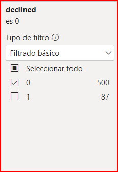

3. **Configurar la visualización** para que muestre la categoría (country) y el porcentaje del total:

   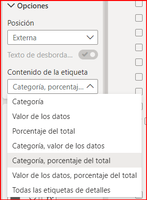

4. **Eliminar la interacción** entre los ejercicios 1 y 2, para no alterar la visualización.

**El resultado final es:**

   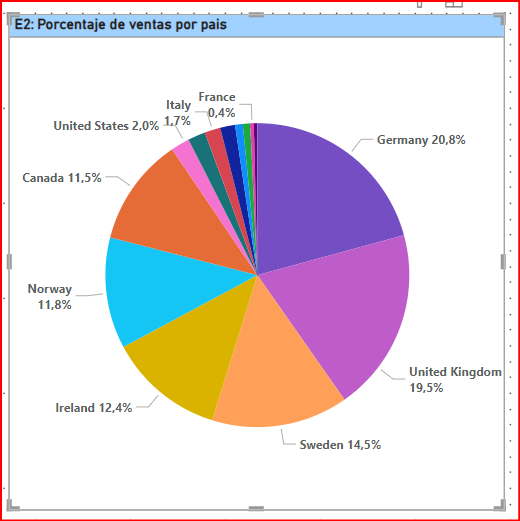

En este caso podemos observar, que Alemanaia tiene sobre un 20% de participación, siendo el que mayor participación tiene.

## Nivell 1 - Exercici 3

Dissenya un indicador visual en Power BI per a analitzar la diferència de vendes entre els anys 2022 i 2021 en cada país. L'empresa està interessada a comprendre com han variat les vendes en diferents països durant aquest període i desitja identificar qualsevol disminució o augment significatiu en les vendes.

1. **Crear dos medidas DAX** para obtener el promedio de ventas. Esto permite tener un valor que represente mejor las diferencias, ya que el 2021 contiene más datos que el 2022.

   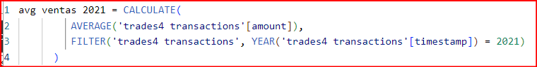
   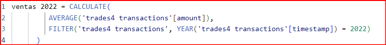

2. **Crear una medida DAX** para calcular el crecimiento comparando el año 2022 con 2021. De esta manera se obtiene un dato que permite saber si el crecimiento es positivo o negativo. Agrego el (0) para evitar errores en caso de división por cero. 

   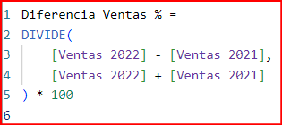

3. **Elegir la visualización** adecuada teniendo en cuenta lo siguiente:
   1. Será un gráfico que indique las ventas por año de cada país.
   2. Tendrá una línea o puntos que indiquen la variación de las ventas entre 2022 y 2021.

   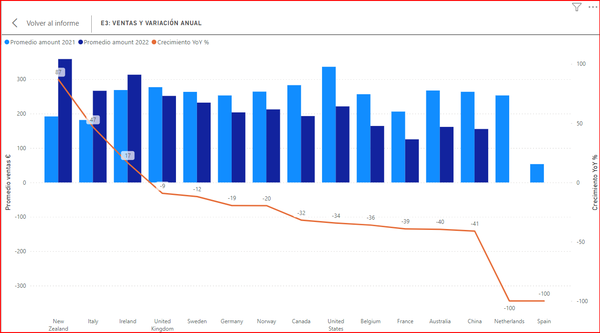

Podemos deducir que la mayoria de paises muestran una disminución en las ventas (promedio), comparando el 2022 y 2021.

## Nivell 1 - Exercici 4

Crea una visualització en la qual es pugui comptabilitzar el nombre de transaccions rebutjades en cada país per a mesurar l'eficàcia de les operacions. Recorda que l'empresa espera tenir menys de 5 transaccions rebutjades per país.

1. Para esta visualización se utilizará una matriz considerando país (country) y la suma de `declined`.

2. **Agregar un icono** que indique si el KPI de 5 transacciones rechazadas se alcanza por país:

      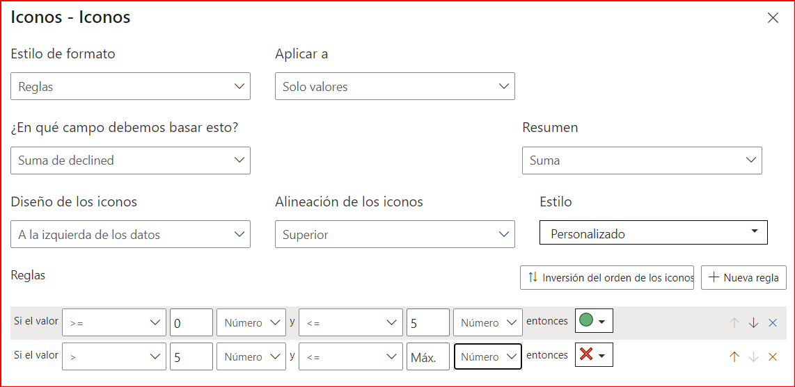

3. **El resultado es el siguiente**:

   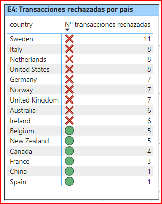

Al visualizar tanto 2022 como 2021, vemos que el objetivo es cumplido por 6 de los 15 paises.

## Nivell 1 - Exercici 5

L'empresa busca comprendre la distribució geogràfica de les vendes per a identificar patrons i oportunitats específiques en cada regió. Selecciona la millor visualització per a mostrar aquesta informació.

Para esto, se genera una visualización mediante un mapa, donde el tamaño de las burbujas será relativo al recuento de transacciones de cada país. Así tenemos lo siguiente:

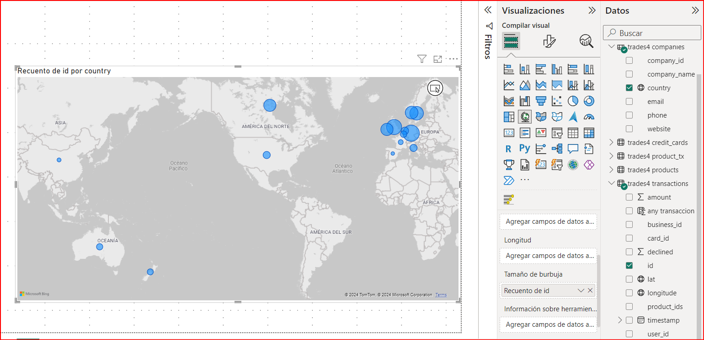

Finalmente, el dashboard general es el siguiente:

Podemos ver las transacciones se concentran principalmente en Europa y que es Alemania el que concentra el mayor numero de transacciones.

## Nivell 1 - Exercici 6

El teu cap t'ha demanat preparar una presentació per al teu equip en la qual es detallin la informació de tots els gràfics visualitzats fins ara. Per a complir amb aquesta sol·licitud, has de proporcionar una interpretació de les visualitzacions obtingudes.

### Análisis de Transacciones en España

---

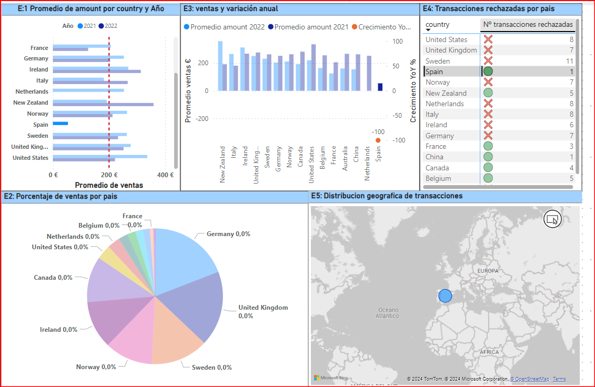

---

***España*** se destaca por su baja participación en el panorama global de transacciones financieras. En el gráfico E2, esta realidad se hace evidente al observar la marcada diferencia en la participación de *España* en comparación con otros países.

Es notable mencionar que en el año 2022, *España* no registró ninguna transacción, lo que resultó en una media de ventas de **0 €** para dicho año. Esta circunstancia explica la drástica disminución del **100%** en el volumen de transacciones de *España* en ese período.

Adicionalmente, es importante destacar que solo se rechazó una transacción en *España*, una cifra notablemente por debajo del **KPI** establecido de **5** y también inferior al promedio de rechazos en otros países analizados. Aunque este dato sugiere un cumplimiento satisfactorio de los **KPIs**, también podría estar relacionado con el reducido volumen total de transacciones realizadas en el país.

Estos indicadores subrayan la necesidad de una mayor exploración y análisis del panorama financiero de *España* para comprender a fondo su posición en el contexto global
