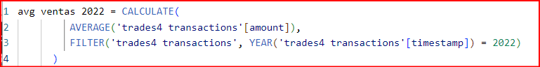

# SPRINT 6

## Nivell 1 -  Exercici 1

L'empresa necessita avaluar el rendiment de les vendes a nivell internacional. Com a part d'aquest procés, et demanen que triïs un gràfic en el qual es detalli la mitjana de vendes desglossades per país i any en una mateixa presentació visual. És necessari assenyalar les mitjanes que són menors a 200 euros anuals.

Para ello, seguimos los siguientes pasos:

   1. **Crear una tabla** con las siguientes columnas: país, año, y el promedio de ventas para estos dos criterios.
   

   2. **Seleccionar un gráfico de barras agrupadas** que permita ver de manera ordenada las ventas por cada año en cada país.
   

   3. **Agregar una línea constante** que indique el KPI de 200 € para resaltar los promedios inferiores a este valor:
   

   4. **Incluir una segmentación de datos** por año y país al lado del gráfico para un análisis dinámico de la visualización.    
   

   5. **Filtrar los datos** para asegurarse de que solo se muestran las transacciones aprobadas (`declined = 0`):    
   

### Analisis del exercici 1

Finalmente, el dashboard resultante es el siguiente:

De esta visualización podemos ver que:

   1. **Desempeño de Ventas en el 2021:** en el año 2021, no se cumplen los objetivos de ventas en Italia, Nueva Zelanda y España. Sin embargo, en los 12 paises restantes efectivamente se cumple el KPI de 200 €.
   
   2. **Objetivos en el 2022:** Al momento de obtener estos datos es posible observar que pocos paises alcanzan el objetivo de 200 €. Son siete paises los que superan el KPI a la fecha del año 2022.
   
   3. **Ausencia de Datos para los Países en el 2022:** Es posible observar que no hay datos disponibles para Netherlands y España en el año 2022 en la visualización. Esto puede indicar que no hubo transacciones registradas para estos países en ese período.

## Nivell 1 - Exercici 2

L'empresa està interessada a obtenir una visió general de les transaccions realitzades per cada país. La teva tasca és crear una visualització que identifiqui el percentatge de les vendes per país.

Los pasos para lograr esto son:

   1. **Crear una tabla** que indique país (country) y la suma del importe (amount).

   2. **Filtrar los datos** para asegurarse de que solo se muestran las transacciones aprobadas (`declined = 0`):
   

   3. **Configurar la visualización** para que muestre la categoría (country) y el porcentaje del total:
   

   4. **Eliminar la interacción** entre los ejercicios 1 y 2, para no alterar la visualización.

### Analisis del exercici 2

El gráfico muestra la distribución de ventas por país, representada por diferentes colores. En este caso, se puede observar que Alemania tiene una participación superior al 20%, siendo el país con mayor participación en las ventas. Le siguen el Reino Unido (UK), Suecia e Irlanda. Norteamérica, que incluye a Canadá y Estados Unidos (USA), representa el 13.5% del total de las ventas.

Por otro lado, el país con la menor participación en ventas es España, que representa únicamente el 0.07% del total de ventas.

## Nivell 1 - Exercici 3

Dissenya un indicador visual en Power BI per a analitzar la diferència de vendes entre els anys 2022 i 2021 en cada país. L'empresa està interessada a comprendre com han variat les vendes en diferents països durant aquest període i desitja identificar qualsevol disminució o augment significatiu en les vendes.

   1. **Crear dos medidas DAX** para obtener el promedio de ventas. Esto permite tener un valor que represente mejor las diferencias, ya que el 2021 contiene más datos que el 2022.

   
   

   2. **Crear una medida DAX** para calcular el crecimiento comparando el año 2022 con 2021. De esta manera se obtiene un dato que permite saber si el crecimiento es positivo o negativo. Agrego el (0) que se devuelve si el denominador es 0 (para evitar errores de división por cero).

   La fórmula Crecimiento YoY % calcula el porcentaje de crecimiento de las ventas promedio de un año con respecto al año anterior, manejando de manera segura la posible división por cero y expresando el resultado como un porcentaje.

   

   3. **Elegir la visualización** adecuada teniendo en cuenta lo siguiente:

      1. Será un gráfico que indique las ventas por año de cada país.
      2. Tendrá una línea o puntos que indiquen la variación de las ventas entre 2022 y 2021.

### Analisis exercici 3

Se puede deducir que la mayoría de los países experimentaron una disminución en las ventas promedio al comparar los años 2022 y 2021. Esta disminución se destaca claramente en el gráfico, que resalta las diferencias negativas. No obstante, Nueva Zelanda, Irlanda e Italia registraron un aumento en sus ventas durante este período.

Por otro lado, Países Bajos y España presentan una disminución del 100%, ya que no se registraron transacciones en estos países durante el 2022.

## Nivell 1 - Exercici 4

Crea una visualització en la qual es pugui comptabilitzar el nombre de transaccions rebutjades en cada país per a mesurar l'eficàcia de les operacions. Recorda que l'empresa espera tenir menys de 5 transaccions rebutjades per país.

   1. Para esta visualización se utilizará una matriz considerando país (country) y la suma de `declined`.

   2. **Agregar un icono** que indique si el KPI de 5 transacciones rechazadas se alcanza por país:

      

### Analisis exercici 4

Al visualizar los datos de 2022 y 2021, se observa que solo 6 de los 15 países cumplieron con el objetivo de tener un máximo de 5 transacciones declinadas. Estos países son Bélgica, Nueva Zelanda, Canadá, Francia, China y España. Cabe destacar que España tuvo solo 1 transacción declinada; sin embargo, esto se debe en parte a que el número total de transacciones en España es relativamente bajo.

## Nivell 1 - Exercici 5

L'empresa busca comprendre la distribució geogràfica de les vendes per a identificar patrons i oportunitats específiques en cada regió. Selecciona la millor visualització per a mostrar aquesta informació.

Para esto, se genera una visualización mediante un mapa, donde el tamaño de las burbujas será relativo al recuento de transacciones de cada país. Así tenemos lo siguiente:

### Analisis exercici 5

En el mapa de visualización, sobresale el Reino Unido y Alemania como los países con un mayor volumen de compras, mientras que Canadá, Suecia, Noruega e Irlanda presentan un número de transacciones intermedio. Por otro lado, los países con un menor número de transacciones incluyen a Estados Unidos, España, Francia, Italia, Bélgica, Países Bajos, China, Australia y Nueva Zelanda. 

El tamaño de cada burbuja en el mapa se corresponde con el número de transacciones por país, lo que ofrece una representación visual precisa del nivel de actividad comercial.

## Nivell 1 - Exercici 6

El teu cap t'ha demanat preparar una presentació per al teu equip en la qual es detallin la informació de tots els gràfics visualitzats fins ara. Per a complir amb aquesta sol·licitud, has de proporcionar una interpretació de les visualitzacions obtingudes.

### Análisis de Transacciones en España

---

---

***España*** se destaca por su baja participación en el panorama global de transacciones financieras. En el gráfico E2, esta realidad se hace evidente al observar la marcada diferencia en la participación de *España* en comparación con otros países.

Es notable mencionar que en el año 2022, *España* no registró ninguna transacción, lo que resultó en una media de ventas de **0 €** para dicho año. Esta circunstancia explica la drástica disminución del **100%** en el volumen de transacciones de *España* en ese período.

Adicionalmente, es importante destacar que solo se rechazó una transacción en *España*, una cifra notablemente por debajo del **KPI** establecido de **5** y también inferior al promedio de rechazos en otros países analizados. Aunque este dato sugiere un cumplimiento satisfactorio de los **KPIs**, también podría estar relacionado con el reducido volumen total de transacciones realizadas en el país.

Estos indicadores subrayan la necesidad de una mayor exploración y análisis del panorama financiero de *España* para comprender a fondo su posición en el contexto global