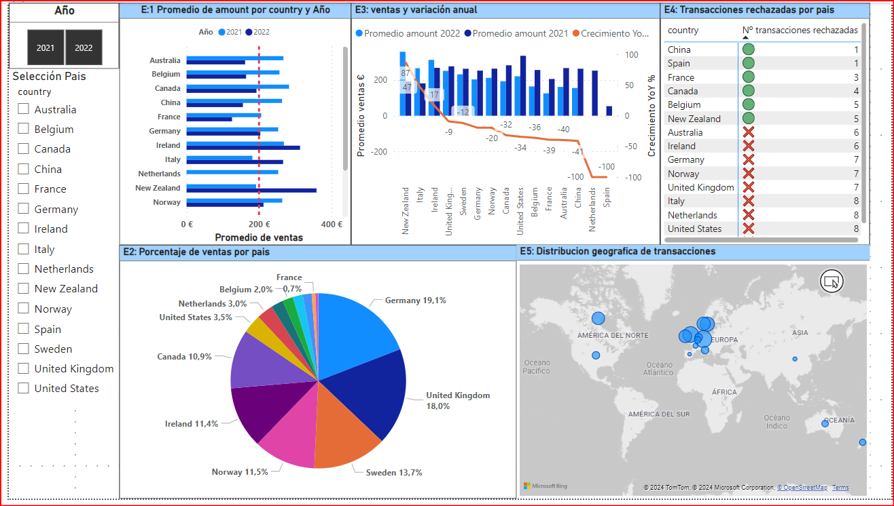

# SPRINT 6

En el nivel 1, se espera que generes visualizaciones que faciliten la comprensión del patrón de ventas por país. 

## Nivell 1 -  Exercici 1

L'empresa necessita avaluar el rendiment de les vendes a nivell internacional. Com a part d'aquest procés, et demanen que triïs un gràfic en el qual es detalli la mitjana de vendes desglossades per país i any en una mateixa presentació visual. És necessari assenyalar les mitjanes que són menors a 200 euros anuals.

1. Creo una tabla que tenga:
    1. promedio de ventas, país, año.
   
    2. Con la visualización anterior elijo el grafico de barras agrupadas que me permite ver de manera ordenada cada año. 
    
    3. Agrego una línea constante que indique el KPI = 200 €:
    
    4. Finalmente agrego al costado una segmentación de datos con año y country, de manera que sirva para poder analizar dinámicamente la visualización.
    

2. Finalmente el dashboard es el siguiente:

## Nivell 1 - Exercici 2

L'empresa està interessada a obtenir una visió general de les transaccions realitzades per cada país. La teva tasca és crear una visualització que identifiqui el percentatge de les vendes per país.

1. En primer lugar, realizo una tabla que indique: country y suma amount
2. Filtro el grafico a través de ‘declined = 0’:
   

3. Indico a la visualización que indique categoría (country) y porcentaje del total:
   

4. Elimino la interacción entre el ejercicio 1 y 2, para no alterar la visualización.  

   El resultado final es:
   

## Nivell 1 - Exercici 3

Dissenya un indicador visual en Power BI per a analitzar la diferència de vendes entre els anys 2022 i 2021 en cada país. L'empresa està interessada a comprendre com han variat les vendes en diferents països durant aquest període i desitja identificar qualsevol disminució o augment significatiu en les vendes.

1. Creo dos medidas DAX para tener el promedio de venta. Esto me permite tener un valor que represente mejor las diferencias, ya que el 2021 contiene más datos que el 2022.
   
   

2. A continuación, creo una medida DAX para obtener el crecimiento comparando el año 2022 con 2021. De esta manera obtengo un dato que permite saber el crecimiento es positivo o negativo. 
   

3. Para escoger la visualización tendré presente lo siguiente:
   1. Será un grafico que indique las ventas por año de cada pais.
   2. Tendrá una linea o puntos que indiquen la variación de las ventas entre 2022 y 2021.
   

## Nivell 1 - Exercici 4

Crea una visualització en la qual es pugui comptabilitzar el nombre de transaccions rebutjades en cada país per a mesurar l'eficàcia de les operacions. Recorda que l'empresa espera tenir menys de 5 transaccions rebutjades per país.

1. Para esta visualización utilizaré una matriz considerando country y suma de 'declined'. 

2. Agrego un icono que indique si el KPI de 5 declined se alcanza por país:
      

3. El resultado es el siguiente:
   

## Nivell 1 - Exercici 5

L'empresa busca comprendre la distribució geogràfica de les vendes per a identificar patrons i oportunitats específiques en cada regió. Selecciona la millor visualització per a mostrar aquesta informació.

Para esto genero una visualización mediante un mapa, de esta manera el tamaño de la s burbujas será relativo al recuento de transacciones de cada pais. Asi tenemos lo siguiente:

Finalmente el dashboard general es el siguiente: 

## Nivell 1 - Exercici 6

El teu cap t'ha demanat preparar una presentació per al teu equip en la qual es detallin la informació de tots els gràfics visualitzats fins ara. 

Per a complir amb aquesta sol·licitud, has de proporcionar una interpretació de les visualitzacions obtingudes. 

La presentació pot realitzar-se amb la informació general o seleccionant un element en particular, com per exemple, els resultats d'Espanya.

**Descripción de España:**

Podemos observar que España concentra una baja proporción de las transacciones a nivel global.
En el gráfico E2, se evidencia que la participación de España es significativamente menor en comparación con otros países. Además, España no registró transacciones en el año 2022, lo que resulta en una media de 0 € para ese año. Este hecho explica la disminución del 100% en el volumen de transacciones de España.
Las transacciones rechazadas en España son únicamente 1, lo cual está por debajo del KPI establecido de 5 y también por debajo del promedio de los otros países analizados. Aunque este dato es favorable en términos de cumplimiento de KPIs, también puede estar correlacionado con el bajo volumen total de transacciones realizadas en el país.
