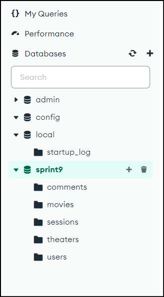
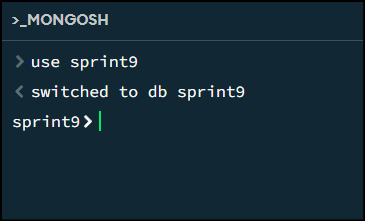
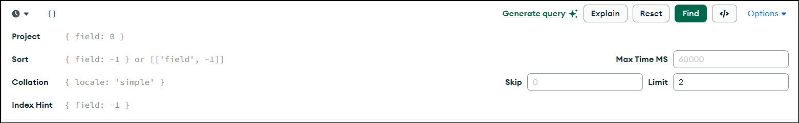
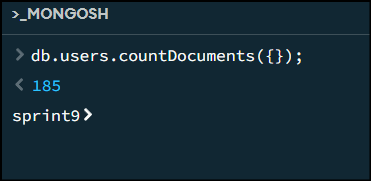
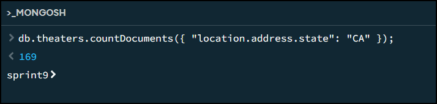
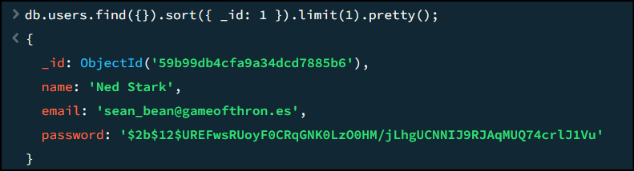
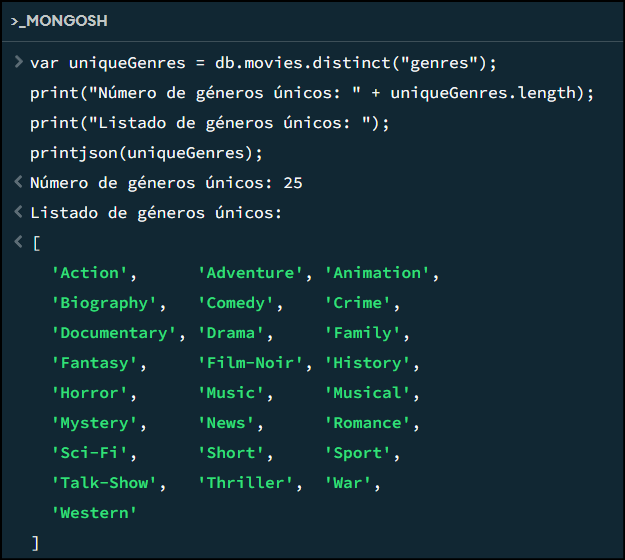
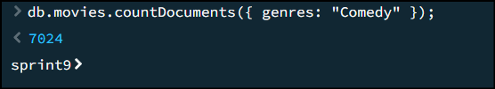

## Tasca S9.01. Consultes amb MongoDB

Trabajaremos con una base de datos que contiene colecciones relacionadas con una aplicación de entretenimiento cinematográfico:

- **users**: Almacena información de usuarios/as, incluyendo nombres, correos electrónicos y contraseñas cifradas.
- **theatres**: Contiene datos de cines, como ID, ubicación (dirección y coordenadas geográficas).
- **sessions**: Guarda sesiones de usuario, incluyendo ID de usuario y tokens JWT para la autenticación.
- **movies**: Incluye detalles de películas, como trama, géneros, duración, elenco, comentarios, año de lanzamiento, directores, clasificación y premios.
- **comments**: Almacena comentarios de usuarios/as sobre películas, con información del autor/a del comentario, ID de la película, texto del comentario y la fecha.

Llevarás a cabo algunas consultas que te pide el cliente/a, el cual está midiendo si serás capaz o no de hacerte cargo de la parte analítica del proyecto vinculado con su base de datos.

## Nivell 1

1. Crea una base de datos con MongoDB utilizando como colecciones los archivos adjuntos


2. Es necesario indicar la base de datos que queremos utilizar:         



### Exercici 1

#### Exercici 1.1 Muestra los 2 primeros comentarios que hay en la base de datos.

Obtengo de la tabla `comments` los dos primeros datos. Para ello puedo obtener desde la parte de "find" lo siguiente:



De esta manera el resultado es:         


Tambien es posible obtenerlo a traves del comando `db.comments.find({}).limit(2);` De esta manera el resultado es: 


#### Exercici 1.2 ¿Cuántos usuarios tenemos registrados?

  
En este caso, debo obtener la informacion de la tabla `users`, para ello utilizo el siguiente comando: `db.users.countDocuments({});`        




#### Exercici 1.3 ¿Cuántos cines hay en el estado de California?
 

Para esto utlizo la tabla de **theatres**:

1. Para verificar si hay cines en California en la colección theater, puedes realizar una consulta que filtre los documentos donde el campo state sea igual a "CA". 
   
db.theater.find({ "location.address.state": "CA" }).limit(5).pretty();

db.theater.countDocuments({ "location.address.state": "CA" });



#### Exercici 1.4 ¿Quién fue el primer usuario/a en registrarse?

Para determinar quién fue el primer usuario en registrarse en users, necesito ordenar los documentos por el campo _id en orden ascendente, ya que el campo _id contiene un valor de timestamp que refleja el momento en que se creó el documento.

```
db.users.find({}).sort({ _id: 1 }).limit(1).pretty();
```



#### Exercici 1.5 ¿Cuántas películas de comedia hay en nuestra base de datos?


De la tabla se puede observar que hay 25 generos: 
```
db.movies.distinct("genres").length;
```


Finalmente haciedno la consulta, podemos ver que hay 7024 peliculas




### Exercici 2


#### Exercici 2.1: Muéstrame todos los documentos de las películas producidas en 1932, pero que el género sea drama o estén en francés.


`db.movies.find({year: 1932})`      
`db.movies.find({ genres: "Drama" })`   
`db.movies.find({languages : "French"})`

```
db.movies.countDocuments({year: 1932,
  $or: [{ genres: "Drama" }, { languages: French" }]})
```
Son 18 peliculas que cumplen con este criterio.
```
db.movies.find({year: 1932,
  $or: [{ genres: "Drama" }, { languages: "French" }]})
```

### Exercici 3

#### Exercici 3.1: Muéstrame todos los documentos de películas estadounidenses que tengan entre 5 y 9 premios y que fueron producidas entre 2012 y 2014.

