## Sprint S9.01. Consultas con MongoDB - Nivell 1

Trabajaremos con una base de datos que contiene colecciones relacionadas con una aplicación de entretenimiento cinematográfico:

- **users**: Almacena información de usuarios/as, incluyendo nombres, correos electrónicos y contraseñas cifradas.
- **theatres**: Contiene datos de cines, como ID, ubicación (dirección y coordenadas geográficas).
- **sessions**: Guarda sesiones de usuario, incluyendo ID de usuario y tokens JWT para la autenticación.
- **movies**: Incluye detalles de películas, como trama, géneros, duración, elenco, comentarios, año de lanzamiento, directores, clasificación y premios.
- **comments**: Almacena comentarios de usuarios/as sobre películas, con información del autor/a del comentario, ID de la película, texto del comentario y la fecha.

Llevarás a cabo algunas consultas que te pide el cliente/a, el cual está midiendo si serás capaz o no de hacerte cargo de la parte analítica del proyecto vinculado con su base de datos.

**Crear una base de datos con MongoDB**

Para crear la base de datos utilizando como colecciones los archivos adjuntos   
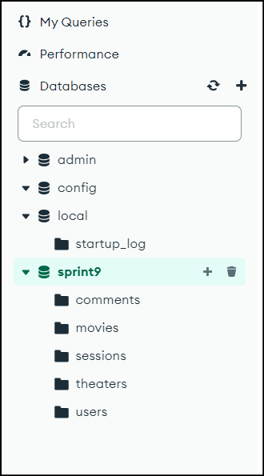

Es necesario indicar la base de datos que queremos utilizar:         
  
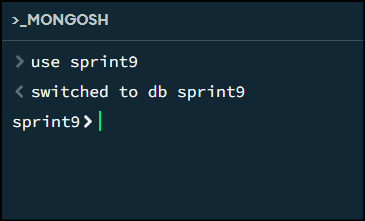

### Exercici 1

#### Exercici 1.1 Muestra los 2 primeros comentarios que hay en la base de datos.

Obtengo de la tabla `comments` los dos primeros datos. Para ello puedo obtener desde la parte de "find" lo siguiente:

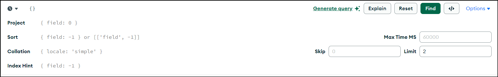

De esta manera el resultado es:         
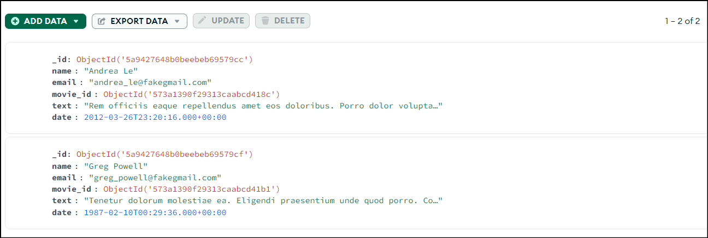

Para obtener los dos primeros comentarios de la tabla `comments` se puede utilizar el siguiente comando:

```javascript
db.comments.find({}).limit(2);
```

De esta manera el resultado es:   

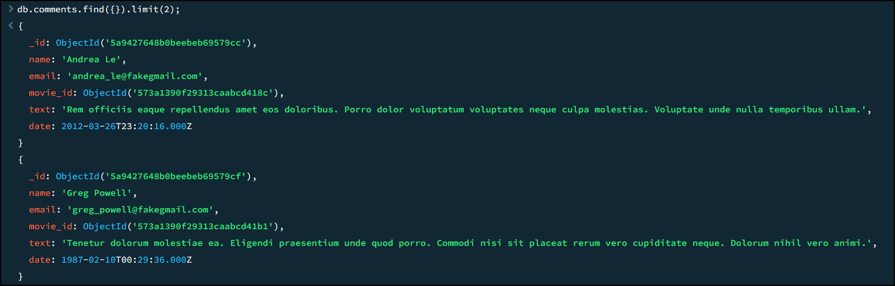

#### Exercici 1.2 ¿Cuántos usuarios tenemos registrados?

En este caso, debo obtener la información de la tabla users, para ello utilizo el siguiente comando:

```javascript
db.users.countDocuments({});
```

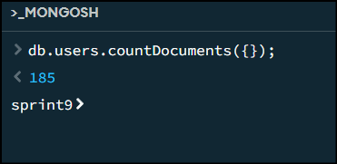

#### Exercici 1.3 ¿Cuántos cines hay en el estado de California?
 
Para esto utlizo la tabla de **theatres**:

1. Para verificar si hay cines en California en la colección theater, puedes realizar una consulta que filtre los documentos donde el campo state sea igual a "CA". 
```javascript
db.theater.countDocuments({ "location.address.state": "CA" });
```
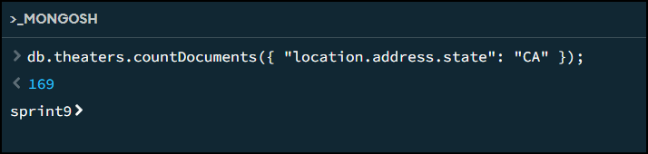

#### Exercici 1.4 ¿Quién fue el primer usuario/a en registrarse?

Para determinar quién fue el primer usuario en registrarse en users, necesito ordenar los documentos por el campo _id en orden ascendente, ya que el campo _id contiene un valor de timestamp que refleja el momento en que se creó el documento.

```javascript
db.users.find({}).sort({ _id: 1 }).limit(1).pretty();
```


#### Exercici 1.5 ¿Cuántas películas de comedia hay en nuestra base de datos?

De la tabla se puede observar que hay 25 generos: 
```javascript
db.movies.distinct("genres").length;
```

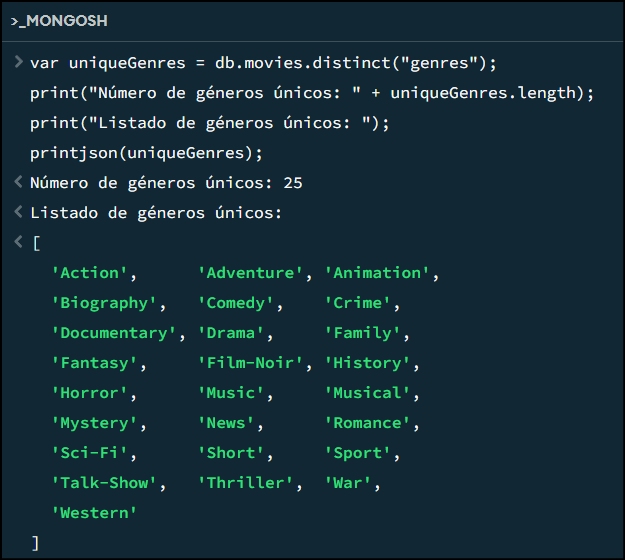

Finalmente haciendo la consulta, podemos ver que hay 7024 peliculas de genero `comedia`.

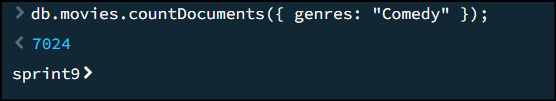

### Exercici 2

#### Exercici 2.1: Muéstrame todos los documentos de las películas producidas en 1932, pero que el género sea drama o estén en francés.

Para encontrar todas las películas producidas en 1932 que sean de género drama o estén en francés, se utiliza la siguiente consulta:

```javascript
db.movies.find({
  year: 1932,
  $or: [{ genres: "Drama" }, { languages: "French" }]});
```

Esta consulta busca en la colección `movies` aquellos documentos que cumplen con las siguientes condiciones:

- El campo `year` es igual a 1932.
- El campo `genres` contiene "Drama" o el campo languages contiene "French".

A continuación muestro el primer elemento que se muestra en la consola:   
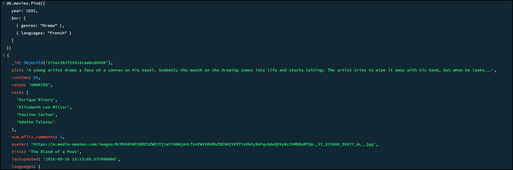

### Exercici 3

#### Exercici 3.1: Muéstrame todos los documentos de películas estadounidenses que tengan entre 5 y 9 premios y que fueron producidas entre 2012 y 2014.

Para encontrar todas las películas estadounidenses que tienen entre 5 y 9 premios y que fueron producidas entre 2012 y 2014, se puede realizar una consulta como la siguiente:


- `type`: "movie": Permite filtrar aquellos documentos que corresponden a peliculas y no a "series".
- `countries`: "USA": Filtra las películas que tienen "USA" como uno de sus países.
- `awards.wins`: { $gte: 5, $lte: 9 }: Filtra las películas que han ganado entre 5 y 9 premios (inclusive).
- `year`: { $gte: 2012, $lte: 2014 }: Filtra las películas que se produjeron entre 2012 y 2014 (inclusive).

```javascript
db.movies.countDocuments({
  type: "movie",
  countries: "USA",
  "awards.wins": { $gte: 5, $lte: 9 },
  year: { $gte: 2012, $lte: 2014 }})
```
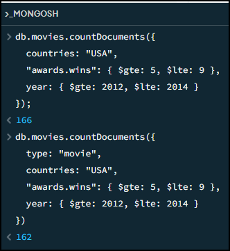

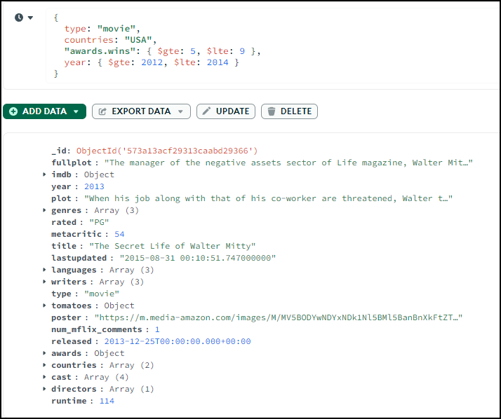

