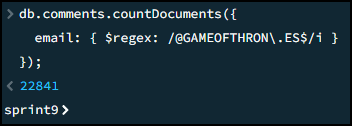
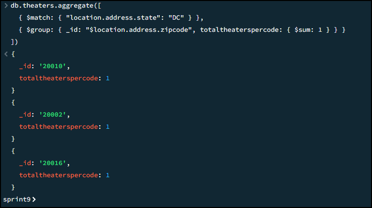

## Sprint S9.01. Consultas con MongoDB - Nivell 2
### Exercici 1
**Cuenta cuántos comentarios escribe un usuario/a que utiliza "GAMEOFTHRON.ES" como dominio de correo electrónico.**

Para contar cuántos comentarios ha escrito un usuario que utiliza "GAMEOFTHRON.ES" como dominio de correo electrónico, puedo usar la siguiente consulta:

Esta consulta utiliza una expresión regular para buscar correos electrónicos que terminan con "@GAMEOFTHRON.ES", sin importar las mayúsculas o minúsculas.

Hay 22814 comentarios realizados por usuarios con el dominio “gameofthron.es”.

### Exercici 2
**¿Cuántos cines hay en cada código postal situados dentro del estado Washington 'DC'?**

Para contar cuántos cines hay en cada código postal dentro del estado Washington D.C. (DC), puedo usar una consulta de agregación.

Esta consulta realiza las siguientes operaciones:

- `$match`: Filtra los documentos para mantener solo aquellos donde location.address.state es "DC".       
- `$group`: Agrupa los documentos por location.address.zipcode. 
- `$sum: 1` para contar el número de documentos en cada grupo, resultando en un conteo de cines por cada código postal.
